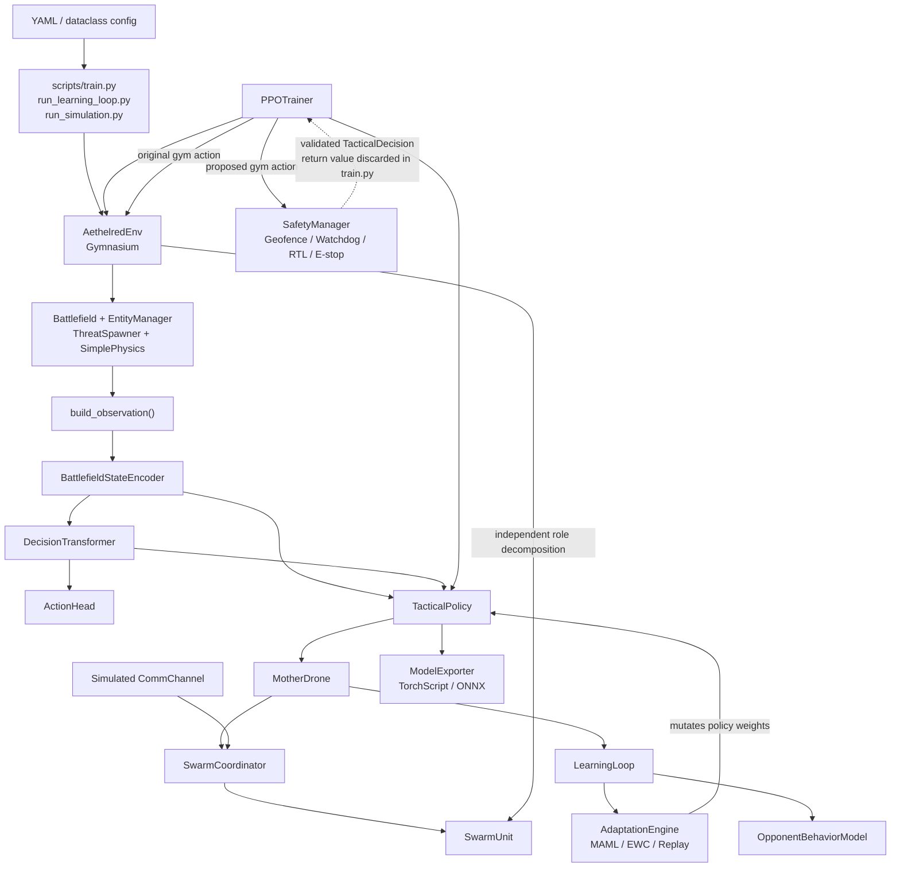
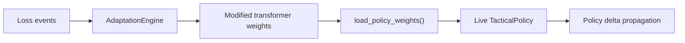
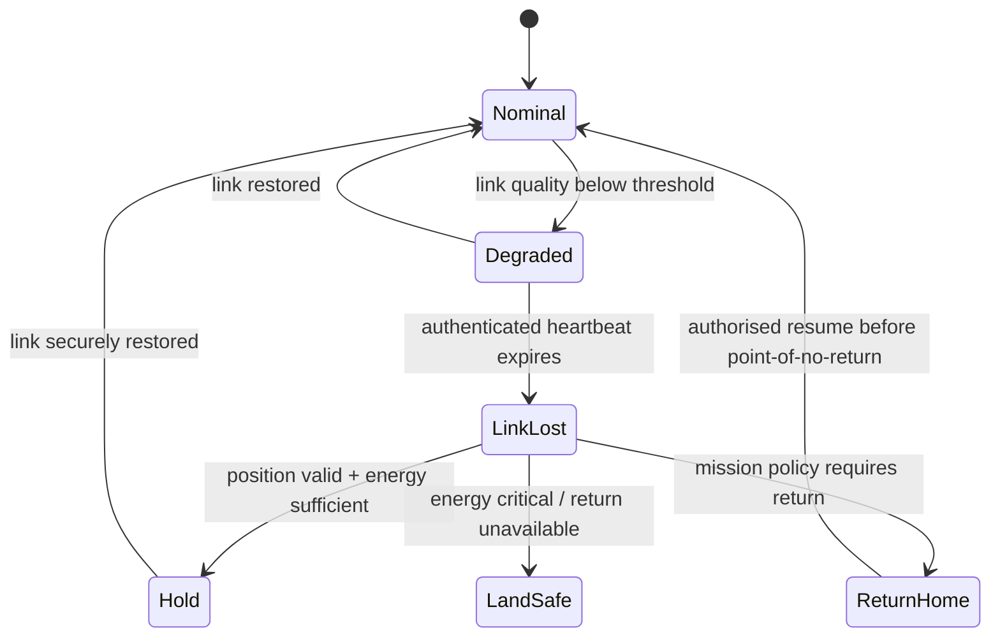
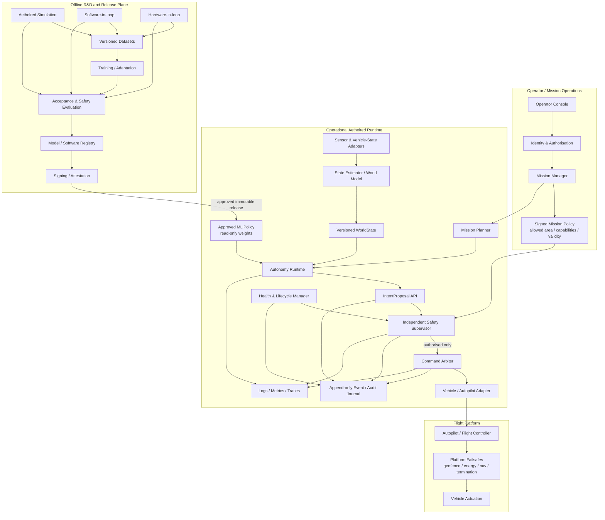
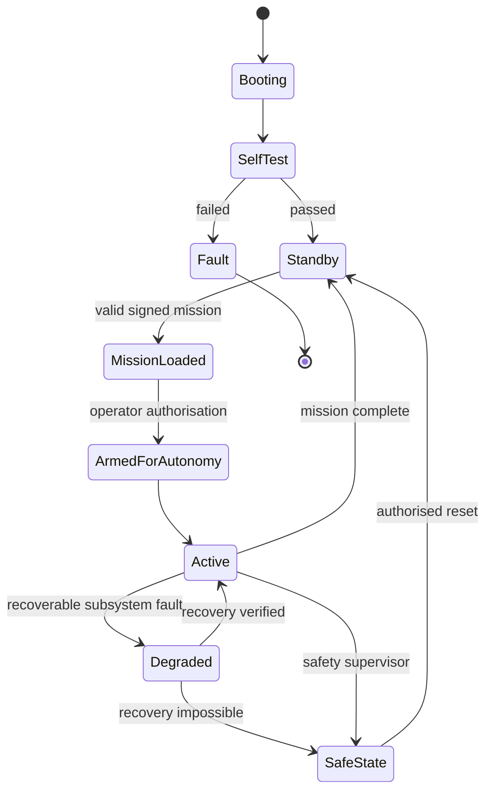
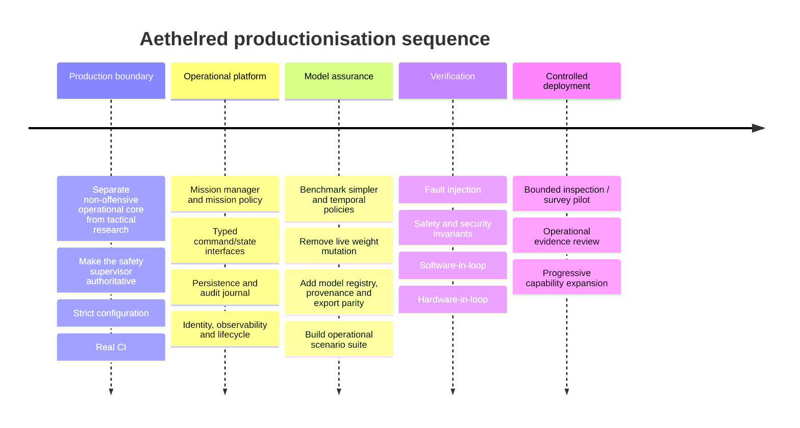
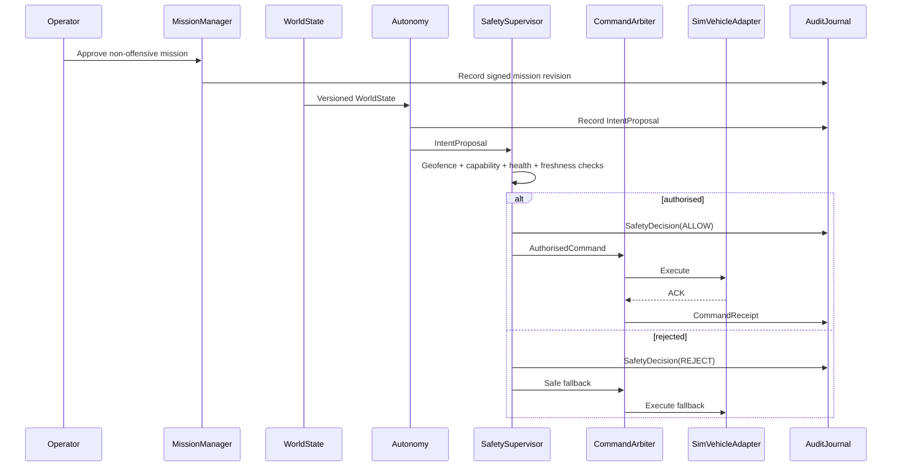

# Aethelred Production Readiness Review

## Executive summary

I reviewed the **Python source code, runtime scripts, configuration system, tests, model-export path, simulation environment, swarm modules and GitHub Actions**, rather than relying primarily on the concept documentation. The review is based on the current `main` implementation under [`/aethelred`](https://github.com/Mintenance-LTD/Aethelred-concept/tree/main/aethelred). The codebase is already sensibly decomposed into `core`, `simulation`, `tactical_ai`, `learning`, `adaptation`, `swarm`, `deployment`, `config` and `utils`, with a conventional Python package structure and explicit development dependencies for pytest, Ruff and mypy. fileciteturn5file0L2-L2 fileciteturn12file0L2-L2

My overall judgement is:

> **Aethelred is a useful autonomy R&D codebase, but it is not currently a production autonomy runtime. The correct next step is not incremental “hardening” of the existing execution loop; it is to preserve the valuable simulation/model components while introducing a new operational architecture around them.**

The most important findings are architectural rather than cosmetic.

| Area | Assessment | Production implication |
|---|---|---|
| Simulation | **Useful R&D foundation** | Keep and extend, but isolate from the operational runtime. |
| State representation | **Promising but simulation-centric** | Refactor into versioned, domain-neutral operational schemas. |
| ML policy | **Not yet validated as an effective decision-maker** | Do not make it authoritative over real vehicles yet. |
| Safety layer | **Good prototype concepts, incorrectly integrated** | Replace with an independent, mandatory authorisation gate. |
| Online adaptation | **Interesting research, unsuitable for live production deployment** | Move all weight-changing adaptation offline/shadow-side. |
| Swarm coordination | **Useful conceptual decomposition** | Refactor around mission tasks, acknowledgements and bounded local autonomy. |
| Communications | **Simulation model only** | Replace operationally with an authenticated transport abstraction. |
| Persistence/audit | **Essentially absent** | Add mission, telemetry, decision, model and safety-event persistence. |
| CI/CD | **Not operational** | Immediate priority. Current Python tests are not executed by the GitHub CI workflow. |
| Non-offensive suitability | **Not separated from combat ontology** | Create a production package whose capability model contains no `ENGAGE`, ammunition, kill reward or offensive fallback. |

There are five findings that should determine the roadmap.

**First, the safety layer does not currently control the action that is executed.** In `train.py`, the code converts the proposed Gym action into a `TacticalDecision`, passes that decision through `SafetyManager.post_decision()`, but ignores the returned corrected decision and subsequently calls `env.step(gym_action)` with the original action. Only the earlier direct modification of `gym_action["target_position"]` for the rectangular geofence survives into execution. Consequently, emergency-stop, RTL and `ActionValidator` corrections are not authoritative in that path. fileciteturn15file0L2-L2 The safety code itself does implement geofencing, watchdog timing, low-fuel/health intervention, heartbeat tracking, RTL and emergency stop, so the problem is primarily **system integration and authority**, not absence of safety ideas. fileciteturn19file0L2-L2 fileciteturn20file0L2-L2

There is an additional subtle problem: the safety path calls `env._decode_action()` before execution, while `env.step()` later calls `_decode_action()` again. Communication status contains random noise, so two decompositions of the same high-level action need not produce the same per-unit behaviour. Safety can therefore inspect one decomposition while the simulator executes another. fileciteturn23file0L2-L2 fileciteturn44file0L2-L2 **Production must have exactly one command decomposition and one safety-authorised execution path.**

**Second, the repository's own recent experiment is strong evidence that the current Decision-Transformer/PPO combination should not be promoted to operational authority.** A deliberately simple held-out experiment asks the policy to distinguish two state types requiring different responses. The experiment reports that across ten training configurations the learned policies collapsed to state-blind constant behaviour, even after an auxiliary loss made the representation distinguish the contexts. fileciteturn54file0L2-L2 The accompanying evaluation source explicitly compares trained policies with random, constant-action and state-dependent oracle baselines on held-out seeds. fileciteturn53file0L2-L2 This is actually a positive sign for the project scientifically: you have built an experiment capable of falsifying your own design assumption. Production engineering should now follow that evidence.

**Third, “Decision Transformer” is currently somewhat misleading as a description of the runtime policy path.** The transformer itself supports causal multi-step sequences, timestep embeddings and `[return, state, action]` token history. fileciteturn38file0L2-L2 However, `TacticalPolicy.forward_step()` always constructs a one-step sequence containing zero previous action and timestep zero. Although the class creates four history deques and exposes `reset_history()`, the runtime inference path never consumes those histories. `update_return()` updates `_current_return`, while `forward_step()` conditions on `_target_return` instead. fileciteturn36file0L2-L2 In operational terms, the current deployed policy is therefore much closer to a **single-state policy network using a transformer block** than a temporal Decision Transformer.

**Fourth, live adaptation currently mutates the operational policy without a validation gate.** `LearningLoop.maybe_adapt()` invokes `AdaptationEngine`, builds modified model weights, immediately loads them into `TacticalPolicy`, and can propagate a delta to swarm units. fileciteturn42file0L2-L2 The adaptation itself learns a proxy threat-response head from hand-coded counter-action labels and then transfers the result to the main transformer's action-type bias with a fixed blend. fileciteturn41file0L2-L2 That is reasonable experimentation, but unacceptable as a production model-update authority because the newly modified policy has not passed regression, safety, robustness, provenance or human approval gates.

**Fifth, CI currently provides virtually no assurance for the Python system.** The main `CI` workflow merely checks out the repository and prints placeholder messages; it never installs the package, executes pytest, Ruff, mypy or model-export tests. fileciteturn9file0L2-L2 The second workflow validates HTML only and invokes a third-party action by movable version tag rather than immutable commit SHA. fileciteturn10file0L2-L2 GitHub's current secure-use guidance recommends pinning actions to full-length commit SHAs because that is the immutable-reference mechanism for Actions. citeturn1search1

The resulting design principle should be:

> **Aethelred ML proposes mission-level intents. It never directly commands motors, changes its own production weights, expands its own authority, or bypasses an independent deterministic safety supervisor.**

This is consistent with the broader assurance principles in the NIST AI Risk Management Framework: operational AI should be managed for validity and reliability, safety, security and resilience, accountability and transparency in its actual context of use. citeturn0search0turn0search28

For Aethelred specifically, I would make the **first production product** an autonomy platform for bounded activities such as area survey, infrastructure inspection, mapping, communications relay and disaster assessment. The existing combat simulation can remain an explicitly isolated R&D extension, but the production package should not contain an offensive action path.

## Current-state architecture and component inventory

### What actually executes today

The code currently has several partially overlapping orchestration paths.

`run_simulation.py` simply constructs `AethelredEnv` and drives it with randomly sampled Gym actions. It is therefore a simulation smoke/demo entry point, not the main autonomy runtime. fileciteturn13file0L2-L2

`run_learning_loop.py` builds the policy, adaptation engine, opponent model, learning loop, environment, mother-node abstraction, swarm coordinator and individual `SwarmUnit`s. `MotherDrone.tick()` runs the policy and uses `SwarmCoordinator.assign_tasks()`, but the script subsequently extracts essentially the first returned decision action, recreates a Gym action and submits that to `AethelredEnv`, which independently decomposes the high-level command again. fileciteturn14file0L2-L2 fileciteturn43file0L2-L2 fileciteturn46file0L2-L2

That means the system currently has **two conceptually different swarm-decomposition layers**:

1. `MotherDrone → SwarmCoordinator → SwarmUnit`
2. `AethelredEnv._decode_action() → per-role actions / SwarmUnit fallback`

The second is what actually affects the simulator in the learning-loop path. fileciteturn23file0L2-L2

The abstract `SimulationInterface` further defines `step(decision: TacticalDecision)`, whereas `AethelredEnv` does not implement that interface and exposes Gym's `step(action: dict)` instead. This is evidence that the intended architecture and the executable architecture have diverged. fileciteturn55file0L2-L2 fileciteturn23file0L2-L2

### Current-state architecture



The useful insight here is that Aethelred does **not** need a complete rewrite. The ML modules, simulation infrastructure and core geometry/state machinery can remain valuable. What needs replacing is the **operational control plane connecting them**.

### Component inventory

“Coverage” below describes what the current test suite visibly exercises; it is **not measured statement/branch coverage**, because the repository's CI does not presently execute `pytest --cov`. The test directory contains substantive tests for adaptation, distillation, export, safety, simulation, swarm behaviour and training. fileciteturn8file0L2-L2

| File/module | Current purpose | Runtime role | Main dependencies | Current test coverage | Decision |
|---|---|---|---|---|---|
| [`core/models.py`](https://github.com/Mintenance-LTD/Aethelred-concept/blob/main/aethelred/src/aethelred/core/models.py) | Pydantic state models and `Vec2` | State contract | Pydantic, NumPy, enums | Indirect through simulator/training/safety | **Refactor** |
| [`core/actions.py`](https://github.com/Mintenance-LTD/Aethelred-concept/blob/main/aethelred/src/aethelred/core/actions.py) | `TacticalAction` / `TacticalDecision` | Policy-output contract | Pydantic, enums | Indirect | **Replace** |
| [`core/enums.py`](https://github.com/Mintenance-LTD/Aethelred-concept/blob/main/aethelred/src/aethelred/core/enums.py) | Roles, threats, actions, formations | Domain ontology | Python Enum | Indirect | **Replace** in production; Keep in R&D |
| [`core/interfaces.py`](https://github.com/Mintenance-LTD/Aethelred-concept/blob/main/aethelred/src/aethelred/core/interfaces.py) | Abstract architectural contracts | Mostly conceptual | ABC, torch, core models | No visible interface-conformance tests | **Replace** |
| [`config/settings.py`](https://github.com/Mintenance-LTD/Aethelred-concept/blob/main/aethelred/src/aethelred/config/settings.py) | YAML→dataclass config | Global configuration | PyYAML, dataclasses | Indirect | **Replace** |
| [`simulation/environment.py`](https://github.com/Mintenance-LTD/Aethelred-concept/blob/main/aethelred/src/aethelred/simulation/environment.py) | Gym environment and action decomposition | Main simulated execution loop | Gymnasium, simulation, swarm | Reproducibility + swarm tests | **Refactor**, R&D only |
| `simulation/battlefield.py`, `physics.py`, `entity_manager.py`, `threat_spawner.py` | Simulated world | Simulator internals | NumPy/core config | Mostly integration coverage | **Keep** in R&D |
| `simulation/renderer.py` | Visualisation | Development only | Matplotlib | No significant visible tests | **Keep** in R&D |
| [`tactical_ai/state_encoder.py`](https://github.com/Mintenance-LTD/Aethelred-concept/blob/main/aethelred/src/aethelred/tactical_ai/state_encoder.py) | Entity/terrain/global encoding | ML perception/state feature layer | Torch, NumPy | Empty-entity regression + training paths | **Refactor** |
| [`tactical_ai/decision_transformer.py`](https://github.com/Mintenance-LTD/Aethelred-concept/blob/main/aethelred/src/aethelred/tactical_ai/decision_transformer.py) | Sequence model | Policy network | PyTorch | Policy/trainer indirect | **Keep in R&D; re-evaluate for production** |
| [`tactical_ai/policy.py`](https://github.com/Mintenance-LTD/Aethelred-concept/blob/main/aethelred/src/aethelred/tactical_ai/policy.py) | Inference wrapper | AI decision authority | Encoder + transformer | Train/inference parity test | **Replace** operational wrapper |
| [`tactical_ai/action_head.py`](https://github.com/Mintenance-LTD/Aethelred-concept/blob/main/aethelred/src/aethelred/tactical_ai/action_head.py) | Hybrid action outputs | Converts model state to tactical actions | PyTorch | Indirect | **Replace** for non-offensive intents |
| `tactical_ai/reward_model.py` | Reward modelling | Training support | PyTorch | Limited/indirect | **Refactor** |
| [`learning/trainer.py`](https://github.com/Mintenance-LTD/Aethelred-concept/blob/main/aethelred/src/aethelred/learning/trainer.py) | PPO, GAE, metrics, checkpoints | Offline training | PyTorch, TensorBoard | Several important regression tests | **Keep + Refactor** |
| [`learning/learning_loop.py`](https://github.com/Mintenance-LTD/Aethelred-concept/blob/main/aethelred/src/aethelred/learning/learning_loop.py) | Live observe→adapt→propagate cycle | Online policy mutation | Adaptation + policy | Adaptation integration partially covered | **Replace** operationally |
| [`adaptation/adaptation_engine.py`](https://github.com/Mintenance-LTD/Aethelred-concept/blob/main/aethelred/src/aethelred/adaptation/adaptation_engine.py) | MAML/EWC/replay adaptation | Live policy modification | PyTorch, MAML, EWC, replay | Dedicated adaptation tests | **Keep R&D only** |
| `adaptation/maml.py`, `ewc.py`, `replay_buffer.py` | Continual-learning research | Adaptation internals | PyTorch/NumPy | Partial | **Keep R&D only** |
| `adaptation/threat_classifier.py`, `opponent_model.py` | Threat knowledge/prediction | Adaptive research layer | Core models, PyTorch | Partial | **Refactor** into hazard/pattern research |
| [`swarm/comms.py`](https://github.com/Mintenance-LTD/Aethelred-concept/blob/main/aethelred/src/aethelred/swarm/comms.py) | Distance/jamming link simulation | Simulated communications | `random`, core models | Comm-loss behaviour tested indirectly | **Keep as simulator; Replace operationally** |
| [`swarm/coordinator.py`](https://github.com/Mintenance-LTD/Aethelred-concept/blob/main/aethelred/src/aethelred/swarm/coordinator.py) | Task assignment and propagation | Command orchestration | SwarmUnit, CommChannel | Heterogeneous behaviour partially covered | **Refactor** |
| [`swarm/swarm_unit.py`](https://github.com/Mintenance-LTD/Aethelred-concept/blob/main/aethelred/src/aethelred/swarm/swarm_unit.py) | Local fallback agent | Degraded-comms autonomy | Torch + hard-coded rules | Comm-loss action smoke test | **Replace** operationally |
| [`swarm/policy_distiller.py`](https://github.com/Mintenance-LTD/Aethelred-concept/blob/main/aethelred/src/aethelred/swarm/policy_distiller.py) | Teacher/student compression | Offline R&D | PyTorch | KL reduction and delta pruning tests | **Keep R&D only** |
| [`deployment/safety.py`](https://github.com/Mintenance-LTD/Aethelred-concept/blob/main/aethelred/src/aethelred/deployment/safety.py) | Geofence/watchdog/RTL/e-stop | Intended safety gate | Core state/actions, NumPy | Only noise-copy + geofence directly tested | **Refactor heavily** |
| [`deployment/exporter.py`](https://github.com/Mintenance-LTD/Aethelred-concept/blob/main/aethelred/src/aethelred/deployment/exporter.py) | TorchScript/ONNX/INT8 export | Deployment artefact generation | PyTorch/ONNX path | TorchScript round-trip + basic latency | **Refactor** |
| `utils/geometry.py`, `utils/seeding.py` | Reusable geometry/reproducibility | General utility | Python/NumPy/Torch | Indirect | **Keep** |
| [`scripts/train.py`](https://github.com/Mintenance-LTD/Aethelred-concept/blob/main/aethelred/scripts/train.py) | Training orchestration | Developer CLI | Most modules | Indirect | **Keep as dev tool; Remove from production runtime** |
| [`scripts/run_learning_loop.py`](https://github.com/Mintenance-LTD/Aethelred-concept/blob/main/aethelred/scripts/run_learning_loop.py) | Demonstrates full concept | Demo orchestration | Most modules | No end-to-end production test | **Replace** |
| [`scripts/run_simulation.py`](https://github.com/Mintenance-LTD/Aethelred-concept/blob/main/aethelred/scripts/run_simulation.py) | Random-policy simulator | Demo CLI | Gym env/config | Simulation smoke functionality | **Keep as dev tool** |
| `configs/scenarios/*` | Combat-oriented simulation scenarios | Experiment inputs | YAML | Used by training/experiments | **Keep isolated in R&D** |
| `tests/*` | Regression suite | Development assurance | pytest | Present but not CI-enforced | **Refactor/expand** |
| [`.github/workflows/blank.yml`](https://github.com/Mintenance-LTD/Aethelred-concept/blob/main/.github/workflows/blank.yml) | Placeholder CI | Repository assurance | GitHub Actions | None | **Replace** |

Two especially useful pieces are worth preserving.

The first is `build_observation()`. It centralises state-to-feature conversion and fixed an earlier train/inference normalisation drift, while the encoder explicitly handles the all-masked-entity condition that could otherwise create NaNs in attention pooling. fileciteturn37file0L2-L2

The second is the testing philosophy embodied by `test_training.py`: the tests check that PPO changes encoder and transformer parameters, prevent LR collapse, exercise empty-entity input and explicitly test train/inference parity. fileciteturn33file0L2-L2 That is exactly the kind of regression-driven engineering that should be expanded.

## Security, safety, data and operational gaps

### Safety authority

The highest-priority architectural rule should be:

```text
Policy proposal → independent safety authorisation → one command arbiter → vehicle
```

There must be **no alternative route**.

The present `SafetyManager` has a useful starting set of functions: rectangular geofence clamping, decision-cycle watchdog, action plausibility checks, low-fuel/health intervention, heartbeat monitoring, RTL, emergency hold and an in-memory safety-event record. fileciteturn19file0L2-L2 fileciteturn20file0L2-L2 But those functions currently exist inside ordinary application code and are not demonstrably independent of the AI process.

For an aircraft integration, Aethelred should sit **above**, rather than replace, the flight controller's own failsafes. PX4, for example, separately implements geofence and failure-response mechanisms at the autopilot level; its current documentation describes geofence failsafes and failure detector responses independently of higher-level autonomy. citeturn0search3turn0search23 The same architectural principle applies whichever autopilot you ultimately select: Aethelred can request navigation behaviour, but the flight-critical controller remains able to reject or terminate unsafe control.

The current safety state is based mainly on the proportion of surviving simulated units. fileciteturn20file0L2-L2 A non-offensive operational safety supervisor needs a different state model: navigation validity, localisation quality, battery/fuel reserve, communication health, vehicle fault state, mission boundary, geofence state, operator link, sensor freshness, decision deadline, model/runtime health and whether the requested intent is permitted by the authorised mission.

### Authentication, authorisation, secrets and command integrity

There is currently no operational network service in the repository, so absence of authentication is not itself a flaw in the simulator. It is, however, a major **missing production subsystem**. `CommChannel` is a probabilistic simulation of signal strength, latency, bandwidth and jamming; it carries no authenticated messages, identities, sequence numbers, acknowledgements, encryption or command expiry. fileciteturn44file0L2-L2

Production needs identities for at least:

| Principal | Required authority |
|---|---|
| Vehicle | Identify itself and accept commands only from authorised command gateways |
| Operator | Mission creation, launch, pause, return and emergency intervention according to role |
| Safety supervisor | Veto authority; not grantable to the ML policy |
| Autonomy runtime | Propose only capabilities explicitly granted by mission policy |
| Deployment service | Install only approved and signed software/model artefacts |
| Maintenance engineer | Diagnostic/configuration authority separated from live mission authority |

If ROS 2 becomes the robotics integration middleware, its official security architecture can secure communication between nodes, and ROS 2 access-control policies can constrain node behaviour. citeturn1search3turn1search19 I would still keep the Aethelred domain core middleware-neutral and put ROS 2 behind adapter interfaces, so the business logic is testable without a live ROS graph.

I found no embedded production secrets in the source reviewed. The real gap is that there is no secrets/configuration boundary yet. Credentials and private keys should not enter YAML mission files or Git. Operational identities should come from a device/identity store and be rotated independently of application configuration.

### Human-in-the-loop and operational-rule enforcement

The existing safety code exposes `emergency_stop()` and `clear_emergency()`, but these are ordinary Python method calls with no authenticated operator concept, acknowledgement state, reason, approval record or durable audit trail. fileciteturn20file0L2-L2

For the stated non-offensive product, I recommend turning “ROE enforcement” into a more general **Mission Authority Policy** with fail-closed capability controls.

A production mission could grant only capabilities such as:

```text
NAVIGATE
SEARCH_AREA
INSPECT_ASSET
CAPTURE_SENSOR
ORBIT
RELAY
HOLD
RETURN_HOME
LAND
```

The present production action ontology must therefore be separated from `TacticalActionType`, which currently includes `ENGAGE`; the core vehicle model also contains ammunition, and the simulation reward explicitly awards threat neutralisation. fileciteturn49file0L2-L2 fileciteturn18file0L2-L2 fileciteturn25file0L2-L2

The important point is that this must not be a configuration option such as `allow_engage: false`. The **production package itself should have no offensive intent** accepted by its command gateway. Combat/tactical concepts may remain in an isolated research package, but those objects should be type-incompatible with the operational vehicle-command interface.

Human oversight should then exist at three different levels:

**Mission approval** establishes the allowed area, time, vehicles, sensor functions and autonomous capabilities.

**Runtime intervention** permits pause, hold, return or safe termination through a path that does not depend on the ML policy responding correctly.

**Model/configuration approval** controls what software and model version may operate on a vehicle.

NIST's AI RMF specifically frames AI risk governance around the actual context of use and emphasises measurement and management rather than treating model performance as the only concern. citeturn0search0turn0search28

### Online learning must leave the operational control loop

This should be one of the firmest changes.

Today:



The new approach should be:

```mermaid
flowchart LR
    EVENTS["Operational / simulation data"] --> DATA["Versioned dataset"]
    DATA --> TRAIN["Offline training / adaptation"]
    TRAIN --> CAND["Candidate model"]
    CAND --> TEST["Regression + safety + robustness suite"]
    TEST --> REVIEW["Approval gate"]
    REVIEW --> SIGN["Signed model artefact"]
    SIGN --> SHADOW["Shadow / canary evaluation"]
    SHADOW --> DEPLOY["Approved deployment"]
```



The current adaptation engine is valuable for research, but it should create **candidates**, never mutate the active operational policy. Current code immediately applies an adaptation result to `TacticalPolicy` and can propagate it to units. fileciteturn42file0L2-L2

### Current data and persistence model

The current `BattlefieldState` is a useful simulation snapshot but not an operational world model. It contains a simulation timestep, friendly units, threats, objectives, terrain data, communication degradation and visibility. Individual entities have UUIDs and some Pydantic field-range validation. fileciteturn18file0L2-L2

Operationally it is missing several critical distinctions.

**Ground truth and estimate are conflated.** The simulator knows true states; a real autonomy platform receives uncertain observations. Noise injection currently creates a noisy copy of the same `BattlefieldState` schema. fileciteturn19file0L2-L2 Production should instead represent:

```text
SensorObservation
        ↓
Track / State Estimate
        ↓
Fused WorldState
        ↓
Policy / Planner Intent
```

Each observation/estimate should carry at minimum a timestamp, source, coordinate frame, data quality/uncertainty and sequence identifier. A simulation adapter can then generate perfect or degraded synthetic observations using exactly those interfaces.

**State is not durably journalled.** Current training artefacts consist primarily of TensorBoard output and Torch checkpoints; safety events, adaptation history, pending loss information, opponent state and swarm status are held in process memory. fileciteturn39file0L2-L2 fileciteturn42file0L2-L2 fileciteturn20file0L2-L2

The production data model should introduce these durable records:

| Entity | Core fields |
|---|---|
| `Mission` | mission ID, revision, creator, approver, validity interval, operating area, allowed capabilities, vehicle assignments |
| `VehicleIdentity` | vehicle ID, platform type, capabilities, software version, configuration version |
| `ObservationEvent` | event ID, monotonic time, UTC time, source, frame, payload/schema version, uncertainty |
| `WorldStateSnapshot` | state revision, source event range, estimator version, stale-data flags |
| `IntentProposal` | proposal ID, policy/model ID, input-state revision, requested intent, confidence/uncertainty |
| `SafetyDecision` | proposal ID, allow/reject/modify, rule IDs, reason, safety-state snapshot |
| `AuthorisedCommand` | unique command ID, expiry, sequence, vehicle, command parameters, safety-decision ID |
| `OperatorAction` | authenticated identity, action, timestamp, mission, reason |
| `ModelArtifact` | model digest, code commit, schema version, training dataset lineage, test report, approval, signature |
| `SafetyEvent` | severity, subsystem, state snapshot, action taken, acknowledged-by |
| `TelemetryRecord` | vehicle health, comms, navigation quality, mission progress, system/runtime metrics |

For early edge deployments, a durable append-only local journal can be simple; a transactional embedded store is adequate before introducing a more complex distributed datastore. Bulk imagery/video should be kept out of the transactional event database and referenced as versioned objects. Base-station synchronisation should be optional rather than a dependency for safe flight.

### Reliability and operational readiness checklist

| Control | Current state | Required state |
|---|---|---|
| Structured application logs | Basic Python text logging | Structured events with mission, vehicle, model and correlation IDs |
| Metrics | TensorBoard training metrics only | Runtime latency, drops, estimator age, safety intervention, CPU/GPU/memory, comms and queue metrics |
| Distributed traces | None | Trace at least observation→intent→safety→command path |
| Safety audit | In-memory `events` list | Durable append-only safety journal |
| Decision deadline | Basic watchdog | Deadline attached to every proposal; expired proposals never execute |
| Heartbeat timing | `time.time()` | Monotonic elapsed-time calculations; wall-clock separately for audit |
| Command acknowledgement | None | Sequence, ACK/NACK, expiry and idempotency |
| Process supervision | None | Lifecycle/health manager with restart/fail-safe behaviour |
| Environment separation | None evident | dev / simulation / SIL / HIL / staging / field release |
| Configuration validation | Manual nested assignment | Strict schema + version + unknown-field rejection |
| Config rollback | None | Versioned approved config with rollback |
| Model rollback | Best-checkpoint notion only | Immutable approved release + previous-known-good model |
| Dependency reproducibility | Lower-bound dependency ranges | Lock/constraints + reproducible build |
| Python CI | Placeholder | pytest, coverage, Ruff, mypy, packaging, export tests |
| Supply-chain provenance | None | Signed/attested release artefacts |
| Fault injection | Limited sensor noise/comms simulation | Process, network, sensor, timing, power/navigation and corrupt-data faults |
| SIL | Simulation is custom only | Runtime interfaces driven against autopilot software-in-loop |
| HIL | None | Actual compute + vehicle controller + sensor/interface emulation |
| Operational monitoring | None | Health dashboard plus local autonomous safe-state behaviour |
| Incident replay | Seeds only | Exact software/config/model + event journal sufficient to reproduce incident |

OpenTelemetry is a reasonable vendor-neutral basis for correlating logs, metrics and traces, rather than inventing separate telemetry formats for each service. Its current specification defines those signals explicitly and supports correlation between them. citeturn1search2turn1search10

For the software lifecycle, NIST's SSDF provides a useful secure-development baseline, and NIST also publishes an AI-specific SSDF profile for AI model development. citeturn0search1turn0search13

## Testing analysis and code-level refactors

### What the existing tests do well

The repository already contains more meaningful tests than the demo status might suggest.

`test_simulation.py` verifies that the environment runs, that identical seeds and actions produce identical reward trajectories, and that different seeds alter simulated starting conditions. fileciteturn30file0L2-L2

`test_training.py` checks several previously important failure modes: learning-rate scheduling, actual gradients reaching the encoder and transformer, finite representation with empty entity groups, inference/training forward-path parity and rollout collection. fileciteturn33file0L2-L2

`test_swarm.py` verifies heterogeneous role decomposition, predicted-position influence on reconnaissance, degraded-communications fallback and adaptation mastery tracking. fileciteturn32file0L2-L2

`test_adaptation.py` verifies that adaptation targets are not a single constant and that EWC/replay participate. fileciteturn34file0L2-L2

`test_distiller.py` verifies that student/teacher KL divergence reduces and that model-delta pruning works. fileciteturn52file0L2-L2

`test_export.py` proves the TorchScript artefact can be saved, reloaded and executed, and has a basic CPU latency smoke test. fileciteturn35file0L2-L2

The largest problem is therefore not “there are no tests”. It is that **production invariants are almost entirely absent and the existing tests are not enforced by CI**. fileciteturn9file0L2-L2

### Required testing matrix

| Test family | Current coverage | Production requirement | Gate |
|---|---|---|---|
| Pure domain/model unit tests | Partial | Every schema, mission-state transition, command invariant | PR |
| Configuration validation | Weak | Unknown fields fail; invalid units/ranges/revisions rejected | PR |
| Geometry/geofence property tests | One clamp test | Boundary, polygons, altitude, invalid coordinates, NaN/Inf, numerical edge cases | PR |
| SafetyManager unit tests | Very weak | Watchdog, E-stop, RTL, low-energy, stale data, invalid intent, restart state | PR |
| Safety execution-chain test | Missing | Prove **no command reaches adapter without SafetyDecision** | PR + release |
| Policy finite-output tests | Partial | NaN/Inf/out-of-range/empty/maximum entity load | PR |
| ML baseline comparison | Experimental | Every candidate compared with deterministic and simple learned baselines on held-out scenarios | Model promotion |
| Temporal-behaviour test | Missing | Prove history affects output if model claims temporal context | Model promotion |
| Export parity | TorchScript smoke only | Python vs TorchScript vs ONNX numerical/action parity on fixed corpus | Release |
| Quantisation regression | Missing | Accuracy/behaviour before vs quantised artefact | Release |
| Model metadata/provenance | Missing | Digest, source commit, dataset/config, test report, signature verified | Release |
| Comm loss | Basic simulated test | Delay, duplication, reordering, corruption, blackout, reconnection and stale commands | SIL/HIL |
| Authentication/authorisation | Missing | Unauthorised operator/node/model/config rejected | Release |
| Sensor fault injection | Noise only | stale, frozen, biased, invalid, conflicting and lost sensors | SIL |
| Navigation degradation | Missing | invalid position/heading/time/frame causes defined safe transition | SIL/HIL |
| Process crash | Missing | policy crash, estimator crash and comm process crash enter deterministic state | SIL/HIL |
| Timing overload | Basic model timing | Deadline miss, CPU saturation and queue buildup tested | SIL/HIL |
| Soak/endurance | Missing | Long missions, memory growth, FD/thread/file exhaustion | Release |
| Multi-vehicle concurrency | Partial simulation | joining/leaving, duplicated IDs, partial comms, command ownership | SIL/HIL |
| Replay/reproducibility | Seed tests | Operational record can recreate policy inputs and safety decision chain | Release |
| HIL | Missing | Real target compute + real/autopilot controller interface | Field gate |
| Field acceptance | Missing | Bounded non-offensive mission acceptance suite | Deployment |

A particularly important policy should be:

> **Safety-code coverage is not the same as safety assurance, but every safety rule should at minimum have direct positive, negative and boundary tests, and the system must contain an architectural test proving bypass is impossible.**

### Refactor the safety execution path

The current logical pattern is effectively:

```python
# Current pattern, simplified from train.py
safety.post_decision(env._decode_action(gym_action), clean_state)
env.step(gym_action)
```

The returned safe decision is not the object executed. fileciteturn15file0L2-L2

The target API should force safe composition:

```python
from dataclasses import dataclass
from enum import Enum
from typing import Generic, TypeVar

T = TypeVar("T")


class SafetyOutcome(str, Enum):
    AUTHORISED = "authorised"
    MODIFIED = "modified"
    REJECTED = "rejected"


@dataclass(frozen=True)
class AuthorisationResult(Generic[T]):
    outcome: SafetyOutcome
    command: T | None
    rule_ids: tuple[str, ...]
    reason: str


proposal = autonomy.propose(world_state, mission)

result = safety_supervisor.authorise(
    proposal=proposal,
    world_state=world_state,
    mission=mission,
)

if result.command is None:
    command_arbiter.execute(safe_fallback.for_state(world_state))
else:
    command_arbiter.execute(result.command)
```

Crucially, `VehicleAdapter.execute()` should accept `AuthorisedCommand`, not `IntentProposal`. That makes bypass difficult structurally rather than relying on every developer to remember to call the safety code.

### Replace permissive configuration parsing

`AethelredConfig._from_dict()` currently walks dataclasses manually and logs/ignores unknown configuration keys. fileciteturn17file0L2-L2

That is friendly for experiments but unsafe for production because a typo can silently leave a default active.

A production configuration should fail closed:

```python
from pydantic import BaseModel, ConfigDict, Field


class RuntimeConfig(BaseModel):
    model_config = ConfigDict(
        extra="forbid",
        frozen=True,
    )

    schema_version: str
    decision_deadline_ms: int = Field(gt=0)
    mission_store_path: str
    telemetry_enabled: bool = True
```

Then separate three concerns that are currently merged:

```text
Software configuration
Mission configuration
Safety policy
```

A mission operator should not be able to alter process-level safety thresholds merely by editing a scenario YAML.

### Fix the exported-model parity problem

`TacticalPolicy` defaults its target return to `10.0`, and the trainer synchronises the policy with its configured `target_return`, which also defaults to `10.0`. fileciteturn36file0L2-L2 fileciteturn17file0L2-L2

The deployment wrapper instead creates its return-to-go tensor using the literal value **5.0**. It also generates dummy inputs with fixed entity/terrain dimensions rather than deriving them from the model's complete schema. fileciteturn21file0L2-L2 fileciteturn22file0L2-L2

That means the exported artefact is not guaranteed to represent the same conditioned policy used during training/in-process inference.

Replace literals with an immutable deployment manifest:

```python
@dataclass(frozen=True)
class ModelRuntimeSpec:
    observation_schema: str
    policy_version: str
    target_return: float
    max_friendlies: int
    max_tracks: int
    terrain_resolution: int
```

Then require a test corpus:

```text
1000+ fixed WorldState examples
        │
        ├── Python model
        ├── TorchScript
        └── ONNX runtime
               ↓
      compare outputs/actions
```

The exact corpus size should ultimately be based on scenario coverage rather than an arbitrary number, but parity should be a **release gate**, not merely “the exported file loaded successfully”.

The exported manifest should also include model digest, complete config digest, state-schema version, source commit, training dataset/version, evaluation report, supported runtime versions and build provenance. GitHub Actions supports cryptographically signed build provenance through artifact attestations, which is suitable for the software/model release pipeline. citeturn1search0turn1search4

### Decide whether Aethelred really needs a Decision Transformer

The current policy maintains history deques but never feeds them into the transformer during `decide()`. The transformer therefore receives T=1. fileciteturn36file0L2-L2 The underlying `DecisionTransformer` implementation is capable of causal temporal sequences, so this is an orchestration/training-design issue rather than a transformer implementation limitation. fileciteturn38file0L2-L2

Do not simply “wire up the deque” and assume the problem is solved. Create a model-selection benchmark:

```text
Deterministic planner/rules
        vs
MLP state policy
        vs
GRU/LSTM temporal policy
        vs
Transformer temporal policy
        vs
RL variant where justified
```

For inspection or disaster-response autonomy, much of the problem can be decomposed into deterministic mission planning, state estimation and trajectory management. ML should only occupy parts where the benchmark demonstrates measurable benefit.

The repository's own state-conditioned experiment makes this especially important: the tested DT/PPO policy failed to outperform simple constant behaviour on a deliberately discriminative scenario. fileciteturn54file0L2-L2

### Correct the action-learning mismatch

`ActionHead` emits discrete action type, formation and target index alongside continuous target position and priority. fileciteturn48file0L2-L2

The PPO probability calculation in `PPOTrainer` includes only the three discrete factors; its own code comments state that position and priority are treated as deterministic and excluded. fileciteturn40file0L2-L2

That creates an important ambiguity about what learning signal is supposed to optimise the continuous control outputs.

For the production redesign, I would avoid solving this by making the RL action space even larger. Instead:

```text
ML / mission planner:
    "inspect asset A"
    "search polygon B"
    "return home"
          ↓
Deterministic trajectory planner:
    path / waypoint / velocity targets
          ↓
Independent safety supervisor
          ↓
Autopilot
```

This dramatically reduces the ML action surface and gives geometry/vehicle constraints to deterministic software.

### Remove live self-modification

The current adaptation pattern should be retained only under `research/`:

```python
# operational runtime: prohibited
active_policy.load_policy_weights(candidate_weights)
```

Replace it conceptually with:

```python
candidate = offline_trainer.train(dataset_version)

report = evaluator.evaluate(
    candidate,
    suite=release_acceptance_suite,
)

if report.passed:
    artefact = registry.create_approved_release(
        candidate=candidate,
        evaluation=report,
    )
```

The deployed runtime should mount model weights read-only and expose its model digest as telemetry.

### Replace the degraded-comms fallback

`SwarmUnit` instantiates `LightweightPolicy`, but `_autonomous_decision()` does not call that neural network; degraded/lost-link behaviour is currently hard-coded role logic. fileciteturn45file0L2-L2 More importantly for the new product scope, the current lost-communications logic can autonomously select an `ENGAGE` action for an engagement-role unit. fileciteturn45file0L2-L2

For a non-offensive operational build, communications loss should transition through an explicit deterministic state machine, for example:



Exact behaviour belongs in platform- and mission-specific policy, but it should never invent new mission authority during loss of command.

### Replace the CI immediately

The repo already declares appropriate development tooling in `pyproject.toml`, including pytest, pytest-cov, Ruff and strict mypy. fileciteturn12file0L2-L2

The minimum pull-request pipeline should therefore become:

```text
Checkout
  ↓
Install locked dependencies
  ↓
Ruff
  ↓
mypy --strict
  ↓
pytest + coverage
  ↓
package build
  ↓
TorchScript/ONNX parity test
  ↓
dependency/security checks
  ↓
simulation regression suite
```

For releases:

```text
PR CI
 ↓
release acceptance scenarios
 ↓
SIL/HIL evidence
 ↓
build immutable artefacts
 ↓
produce SBOM/provenance
 ↓
sign/attest
 ↓
manual environment approval
 ↓
staged deployment
```

GitHub recommends immutable SHA pinning for Actions dependencies, and its artifact-attestation system can establish signed build provenance. citeturn1search1turn1search0 This also aligns with the practices encouraged by NIST's SSDF. citeturn0search1

## Recommended target architecture

The central architectural change is to split Aethelred into **three trust zones**:

**Operational safety and command plane** — deterministic and authoritative.

**Autonomy plane** — may contain ML, planning and prediction, but only proposes bounded mission intents.

**Research/training plane** — simulation, RL, adaptation and model building; never directly connected to an operational vehicle command channel.

### Target system



### Package structure

I would physically reorganise the repository to reinforce that architecture:

```text
aethelred/
├── packages/
│   ├── aethelred_core/
│   │   ├── mission/
│   │   ├── world/
│   │   ├── intents/
│   │   ├── events/
│   │   └── interfaces/
│   │
│   ├── aethelred_autonomy/
│   │   ├── planner/
│   │   ├── policy/
│   │   ├── inference/
│   │   └── coordination/
│   │
│   ├── aethelred_safety/
│   │   ├── supervisor/
│   │   ├── mission_policy/
│   │   ├── geofence/
│   │   ├── command_arbiter/
│   │   └── fallback/
│   │
│   ├── aethelred_runtime/
│   │   ├── lifecycle/
│   │   ├── telemetry/
│   │   ├── persistence/
│   │   └── security/
│   │
│   └── aethelred_adapters/
│       ├── simulator/
│       ├── ros2/
│       └── autopilot/
│
├── research/
│   ├── tactical_sim/
│   ├── adaptation/
│   ├── decision_transformer/
│   ├── experiments/
│   └── training/
│
├── tests/
│   ├── unit/
│   ├── integration/
│   ├── safety/
│   ├── security/
│   ├── simulation/
│   ├── sil/
│   └── hil/
│
└── deployment/
    ├── dev/
    ├── sil/
    ├── hil/
    └── production/
```

This gives you an extremely useful business distinction:

> **Aethelred Core is the autonomy platform. Tactical experiments are consumers of Aethelred Core, not the definition of Aethelred Core.**

That opens the technology to mapping, forestry, inspection, infrastructure monitoring, disaster response and other platform applications without requiring the production software to carry the original combat action ontology.

### Operational runtime interfaces

The most important contracts should be small and explicit:

```python
class WorldStateProvider(Protocol):
    def latest(self) -> WorldState: ...


class AutonomyPolicy(Protocol):
    def propose(
        self,
        state: WorldState,
        mission: MissionContext,
    ) -> IntentProposal: ...


class SafetySupervisor(Protocol):
    def authorise(
        self,
        proposal: IntentProposal,
        state: WorldState,
        mission: MissionContext,
    ) -> AuthorisationResult: ...


class VehicleAdapter(Protocol):
    def execute(self, command: AuthorisedCommand) -> CommandReceipt: ...
```

Do **not** expose `load_policy_weights()` on the operational `AutonomyPolicy` interface. That function belongs to the deployment/lifecycle service, available only when the autonomy component is inactive and after verifying the approved artefact.

Likewise, do not pass arbitrary `dict` actions across component boundaries. The current system does this extensively in the Gym path. fileciteturn13file0L2-L2 Typed, versioned messages are preferable because commands need validation, persistence and backwards-compatible evolution.

### Runtime lifecycle

ROS 2 managed/lifecycle nodes are one possible implementation reference: they make component initialisation and lifecycle state explicit rather than assuming “process exists = ready”. citeturn0search2 Even outside ROS, Aethelred should have lifecycle states resembling:



A model process restarting during flight should not automatically regain command authority simply because it is running again. It should re-establish state freshness, model identity, configuration identity and safety readiness before the command arbiter accepts proposals.

## Phased productionisation roadmap

The estimates below are **engineering person-weeks, not calendar duration**. Workstreams can overlap. They assume an experienced Python/robotics/ML team and exclude aircraft design, country-specific regulatory approval, formal airworthiness certification, custom sensor development and manufacturing. Because you supplied no budget or team size, person-weeks are more meaningful than dates.

### Priority definitions

**P0** means production architecture cannot safely proceed without it.

**P1** establishes the operational platform.

**P2** makes the autonomy/model path measurable and releasable.

**P3** moves the system from software to controlled vehicle integration.

| Priority | Task | Deliverable | Effort | Risk |
|---|---|---|---:|---|
| **P0** | Split production and tactical R&D domains | `aethelred_core` non-offensive ontology; tactical code isolated under research | **2–4 PW** | Medium |
| **P0** | Create one authoritative safety/execution path | `IntentProposal → SafetySupervisor → AuthorisedCommand → VehicleAdapter`; bypass tests | **3–5 PW** | **High** |
| **P0** | Replace config loader | Strict versioned schemas; fail on unknown/invalid values; separate mission/safety/runtime config | **1–2 PW** | Low |
| **P0** | Replace GitHub CI | Ruff, mypy, pytest/coverage, packaging, dependency checks, export smoke tests | **2–3 PW** | Low |
| **P1** | Define operational interfaces and lifecycle | World state, intent, safety, command, vehicle, health contracts | **2–4 PW** | Medium |
| **P1** | Build mission manager/policy | Mission revision, capability allow-list, geofence, validity, operator approvals | **2–4 PW** | Medium |
| **P1** | Add command protocol semantics | Command IDs, sequence, expiry, ACK/NACK, idempotency, stale-command rejection | **2–4 PW** | **High** |
| **P1** | Build persistence/audit layer | Event journal, mission store, model record, safety events, telemetry metadata | **3–5 PW** | Medium |
| **P1** | Add identity/security layer | Operator/service/vehicle identities; authenticated deployment and command channels | **4–7 PW** | **High** |
| **P1** | Add observability/lifecycle supervision | Structured logging, metrics, traces, health checks, process/state supervision | **2–4 PW** | Medium |
| **P2** | Re-benchmark model architecture | Deterministic, MLP/recurrent/transformer baselines; held-out scenario metrics | **3–6 PW** | **High research uncertainty** |
| **P2** | Redesign production policy runtime | Read-only approved models; domain-neutral mission intents; uncertainty/failure behaviour | **3–6 PW** | High |
| **P2** | Remove live operational adaptation | Offline candidate pipeline; validation, approval, signing and rollback | **3–5 PW** | Medium |
| **P2** | Harden model export/registry | Full manifest, digest, config/schema provenance, Python/TS/ONNX parity | **2–4 PW** | Medium |
| **P2** | Build non-offensive scenario library | Survey, inspection, communications, disaster search, degraded GPS/comms/weather | **4–7 PW** | Medium |
| **P2** | Build systematic fault-injection suite | Timing, process, sensor, network, state corruption, navigation/energy faults | **4–7 PW** | High |
| **P2** | Expand automated safety/security testing | Policy invariants, auth tests, property tests, fuzzing, command-chain guarantees | **3–5 PW** | Medium |
| **P3** | Software-in-loop vehicle integration | Real operational runtime against target autopilot SIL | **4–6 PW** | High |
| **P3** | Hardware-in-loop platform | Target edge computer + controller + comm/sensor interface emulation | **6–12 PW** | **High** |
| **P3** | Controlled field-pilot tooling | Mission console, deployment/rollback, incident replay, field test evidence | **6–12 PW** | **High** |

The aggregate engineering magnitude is approximately **63–113 person-weeks** for the full list above, before regulatory/certification and platform-specific hardware work. That is not an argument to do everything before demonstrating value: the roadmap deliberately gives you a useful production software skeleton after P0/P1 while ML and flight integration continue independently.

### Recommended sequencing



### What I would do first in the repository

The first implementation branch should **not touch the neural network architecture**.

I would make the first productionisation milestone entirely architectural:

```text
Milestone: Aethelred Operational Skeleton
```

It should demonstrate:



Initially, `Autonomy` can be a deterministic rule/planner rather than an ML model. That lets you prove the operational architecture before introducing model uncertainty. The existing `AethelredEnv` can become the first `SimVehicleAdapter`.

Then put `TacticalPolicy` behind the same `AutonomyPolicy` interface and run it in **shadow mode**:

```text
deterministic controller → actual simulator command
ML policy               → proposal recorded only
```

You can then compare decisions over thousands of missions without creating vehicle risk.

That separation is much more valuable than spending the next several iterations tuning PPO before the command and safety architecture exists.

## Production acceptance criteria and primary-source basis

### Software readiness gate

Aethelred should not be labelled “production-capable” until all of the following are true.

The command architecture has one and only one vehicle-command gateway, and it accepts only safety-authorised commands. The existing duplicate `TacticalDecision`/Gym-action/decomposition paths are gone. The current discrepancy between `SimulationInterface.step(TacticalDecision)` and `AethelredEnv.step(dict)` is replaced by a shared adapter contract. fileciteturn55file0L2-L2 fileciteturn23file0L2-L2

The production action schema contains **no offensive capability**. `ENGAGE`, threat-destruction rewards and ammunition remain confined to explicitly separated research/simulation packages. The existing sources show all three concepts in the shared domain today. fileciteturn49file0L2-L2 fileciteturn18file0L2-L2 fileciteturn25file0L2-L2

Configuration is strict, versioned and fails closed. Current manual configuration parsing instead ignores unknown fields with warnings. fileciteturn17file0L2-L2

CI executes the real Python assurance suite on every pull request. The existing workflow does not. fileciteturn9file0L2-L2 GitHub Actions dependencies should be pinned according to GitHub's secure-use guidance, and release artefacts should carry verifiable provenance. citeturn1search1turn1search0

### Model readiness gate

No model should be promoted solely because episode reward improved.

Every candidate should beat declared baselines on **held-out scenario distributions**, and results should be broken down by mission/context rather than only averaged globally. This is particularly important because Aethelred's own policy-authority experiment demonstrated that aggregate training did not produce even a simple state-conditional policy. fileciteturn54file0L2-L2

If the production model continues to be described as temporal, an ablation test must show that previous observations materially improve held-out performance. The present runtime ignores its configured history buffers despite the transformer's sequence capability. fileciteturn36file0L2-L2 fileciteturn38file0L2-L2

Python, TorchScript and ONNX representations of the same approved model should pass behavioural parity on an identical frozen evaluation corpus. Current deployment code uses a different fixed return-conditioning value from the normal policy default and hard-coded dummy input dimensions. fileciteturn21file0L2-L2 fileciteturn22file0L2-L2

Operational weights must be immutable during a mission. The present adaptation loop fails this criterion because it directly replaces live policy weights. fileciteturn42file0L2-L2

### Safety readiness gate

Every proposed mission intent must receive an explicit safety decision.

Emergency stop, hold, return and platform-level failsafe behaviour must remain available even if the ML process is hung, crashed, generating invalid data or compromised.

Loss of communications must produce a preauthorised safe state, not increased autonomy authority. The current `SwarmUnit` degraded-comms logic instead switches into role-specific autonomous behaviour. fileciteturn45file0L2-L2

Geofence and flight-critical constraints should exist at both the Aethelred mission/safety layer and the underlying vehicle controller where available. PX4's current documentation provides an example of independently implemented autopilot-level geofence and failure-response mechanisms. citeturn0search3turn0search23

### Operational readiness gate

Every field event must be attributable to:

```text
Mission revision
+ operator authority
+ software build
+ model digest
+ configuration digest
+ world-state revision
+ policy proposal
+ safety decision
+ authorised command
+ vehicle acknowledgement
```

That gives you something the current architecture does not: **the ability to explain exactly why an aircraft did what it did without relying on console logs or reconstructing Python object state after the fact.**

Observability should correlate runtime logs, metrics and traces, for which OpenTelemetry provides a standard vendor-neutral model. citeturn1search2turn1search18 Software/model release governance should incorporate secure-development practices such as those set out by NIST SSDF and its AI profile. citeturn0search1turn0search13

### Primary repository files reviewed

The most consequential source files for the productionisation work are:

[`src/aethelred/simulation/environment.py`](https://github.com/Mintenance-LTD/Aethelred-concept/blob/main/aethelred/src/aethelred/simulation/environment.py) — current executable simulation/action path. fileciteturn23file0L2-L2

[`src/aethelred/deployment/safety.py`](https://github.com/Mintenance-LTD/Aethelred-concept/blob/main/aethelred/src/aethelred/deployment/safety.py) — current safety prototype. fileciteturn19file0L2-L2

[`scripts/train.py`](https://github.com/Mintenance-LTD/Aethelred-concept/blob/main/aethelred/scripts/train.py) — exposes the current safety-integration problem and training/runtime orchestration. fileciteturn15file0L2-L2

[`src/aethelred/tactical_ai/policy.py`](https://github.com/Mintenance-LTD/Aethelred-concept/blob/main/aethelred/src/aethelred/tactical_ai/policy.py) — current inference path and unused temporal-history mechanism. fileciteturn36file0L2-L2

[`src/aethelred/tactical_ai/decision_transformer.py`](https://github.com/Mintenance-LTD/Aethelred-concept/blob/main/aethelred/src/aethelred/tactical_ai/decision_transformer.py) — actual sequence-model implementation. fileciteturn38file0L2-L2

[`src/aethelred/tactical_ai/action_head.py`](https://github.com/Mintenance-LTD/Aethelred-concept/blob/main/aethelred/src/aethelred/tactical_ai/action_head.py) — hybrid action representation. fileciteturn48file0L2-L2

[`src/aethelred/learning/trainer.py`](https://github.com/Mintenance-LTD/Aethelred-concept/blob/main/aethelred/src/aethelred/learning/trainer.py) — PPO, checkpoints, training metrics and current policy-gradient action treatment. fileciteturn39file0L2-L2 fileciteturn40file0L2-L2

[`src/aethelred/learning/learning_loop.py`](https://github.com/Mintenance-LTD/Aethelred-concept/blob/main/aethelred/src/aethelred/learning/learning_loop.py) — live adaptation and propagation authority. fileciteturn42file0L2-L2

[`src/aethelred/adaptation/adaptation_engine.py`](https://github.com/Mintenance-LTD/Aethelred-concept/blob/main/aethelred/src/aethelred/adaptation/adaptation_engine.py) — MAML/EWC/replay and proxy-head transfer logic. fileciteturn41file0L2-L2

[`src/aethelred/swarm/swarm_unit.py`](https://github.com/Mintenance-LTD/Aethelred-concept/blob/main/aethelred/src/aethelred/swarm/swarm_unit.py) and [`swarm/coordinator.py`](https://github.com/Mintenance-LTD/Aethelred-concept/blob/main/aethelred/src/aethelred/swarm/coordinator.py) — degraded-link autonomy and role orchestration. fileciteturn45file0L2-L2 fileciteturn46file0L2-L2

[`src/aethelred/deployment/exporter.py`](https://github.com/Mintenance-LTD/Aethelred-concept/blob/main/aethelred/src/aethelred/deployment/exporter.py) — deployment artefact generation and current parity/provenance gaps. fileciteturn21file0L2-L2

[`src/aethelred/config/settings.py`](https://github.com/Mintenance-LTD/Aethelred-concept/blob/main/aethelred/src/aethelred/config/settings.py) — current permissive configuration system. fileciteturn17file0L2-L2

[`experiments/policy_authority`](https://github.com/Mintenance-LTD/Aethelred-concept/tree/main/aethelred/experiments/policy_authority) — currently the most important evidence about whether the learned tactical policy is actually state-dependent. fileciteturn54file0L2-L2

[`tests`](https://github.com/Mintenance-LTD/Aethelred-concept/tree/main/aethelred/tests) — existing regression suite to preserve and expand. fileciteturn8file0L2-L2

[`.github/workflows/blank.yml`](https://github.com/Mintenance-LTD/Aethelred-concept/blob/main/.github/workflows/blank.yml) — the first repository file I would replace. fileciteturn9file0L2-L2

The architectural objective is therefore not **“make the current combat simulator control a real drone.”** It is:

> **Extract Aethelred's useful state representation, simulation, coordination and autonomy research into a domain-neutral platform; put a deterministic safety and command architecture underneath it; put a governed training/release system above it; then validate the autonomy progressively through simulation, shadow evaluation, SIL, HIL and bounded non-offensive field missions.**

That would turn Aethelred from an interesting autonomous-swarm experiment into the beginnings of a credible **autonomy operating layer**.