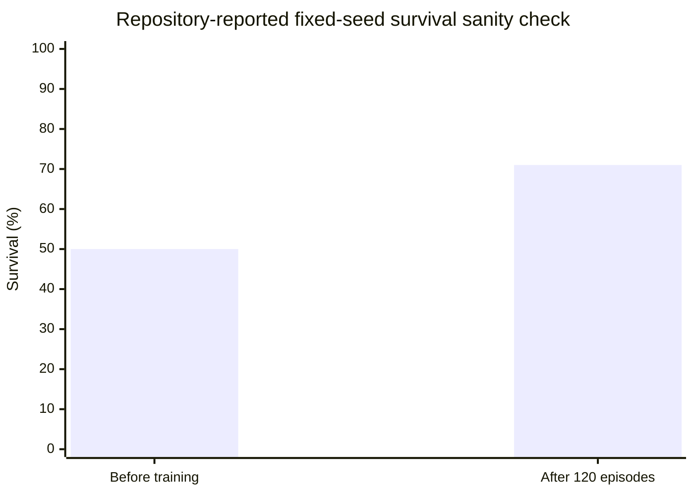
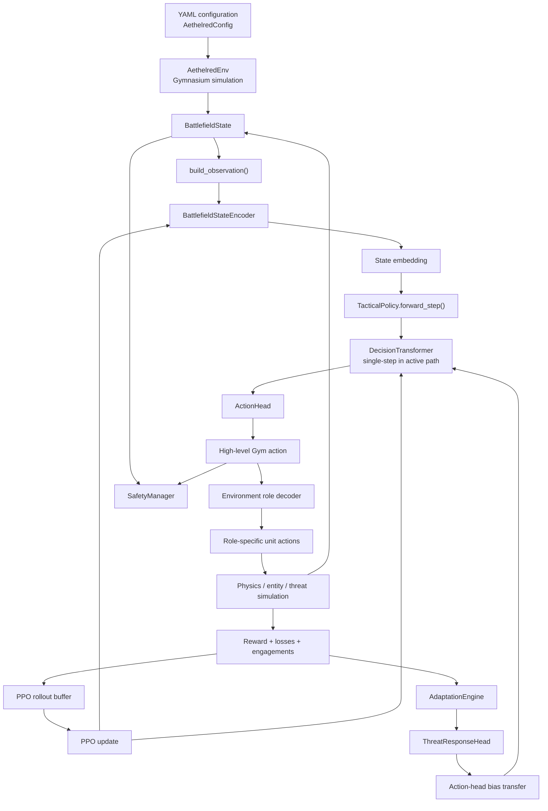
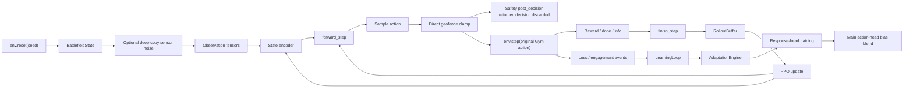

# Aethelred Technical Code-Centred Review for a Defence R&D Programme

## Executive summary

This review examines the **actual Python source code, configuration, tests, Git history, pull requests and GitHub Actions configuration** of `Mintenance-LTD/Aethelred-concept`, rather than relying on the project README alone. The primary baseline is the repository's default `main` branch at commit `581f1c1119354f3223300b5e7f4274dbc2d73be6`, merged on 19 June 2026. There is also a later unmerged `claude/algorithm-audit-lcp5r4` branch, nine commits ahead of `main`, containing further algorithm-audit work; it should not be confused with the production/default branch. fileciteturn44file0 fileciteturn25file0

The overall conclusion is that **Aethelred is a credible research simulation codebase, but not yet a validated autonomous-systems platform and emphatically not a deployable defence capability**. The code is substantially more developed than a concept mock-up: it has a Gymnasium environment, structured state models, attention-based encoding, a PyTorch Transformer policy, PPO updates, a continual-learning subsystem, heterogeneous swarm simulation, testing utilities, model export and explicit safety components. The repository itself correctly states that it has no hardware, actuation or networking and that real-world operation would require human-in-the-loop controls and rules of engagement that are not implemented. fileciteturn43file0

The strongest software-engineering features are the modular package structure, central observation builder, reproducible simulation tests, regression tests demonstrating that PPO gradients reach the encoder and Transformer, use of `yaml.safe_load`, `torch.load(..., weights_only=True)` in checkpoint loading paths, explicit NaN/gradient guards, and a useful negative experiment that compares trained policies with constant and oracle baselines on held-out seeds. fileciteturn29file0 fileciteturn36file0 fileciteturn11file0

The most important technical finding is that the code labelled a **Decision Transformer is not operating as a sequence-conditioned Decision Transformer in the main PPO path**. `TacticalPolicy.forward_step()` supplies a sequence of length one, a zero action embedding, a zero timestep and a fixed target return. Although history deques and a configurable `context_length` exist, they are not consumed by the decision path. The resulting deployed/trained controller is much closer to a **single-state policy passed through a Transformer architecture** than a Decision Transformer exploiting trajectory history. fileciteturn12file0 fileciteturn13file0

A second critical finding is an **action-learning mismatch**. The model outputs five action components, but PPO calculates likelihood and entropy only for `action_type`, `formation` and `target_index`. `target_position` and `priority` are deterministic neural outputs excluded from the policy-gradient objective; consequently, the parameters specific to those two heads receive no direct PPO policy gradient. At the same time, the training environment's high-level action decoder does not use the learned `target_index` to allocate threats—it distributes active threats by the index of each engagement-role unit—yet PPO still spends probability mass and gradient capacity optimising `target_index`. This is a credible mechanism for noisy or ineffective policy optimisation and deserves investigation before abandoning PPO itself. fileciteturn30file0 fileciteturn16file0 fileciteturn33file0

A third critical finding concerns **safety enforcement**. `train.py` invokes `SafetyManager.post_decision()` on a decoded tactical decision, but discards the returned, potentially corrected decision and then calls `env.step(gym_action)` using the original high-level Gym action. A separate geofence clamp *is* applied directly to `gym_action`, so that check affects the environment, but emergency-stop, RTL and per-unit `ActionValidator` corrections returned by `post_decision()` do not constitute an enforced control gate in this training path. This means the code comments describing `SafetyManager` as the “LAST gate” before execution are stronger than the integration actually provides. fileciteturn35file0 fileciteturn21file0

The continual-learning claims also need narrowing. The repository implements MAML-, EWC- and replay-inspired components, but operational adaptation occurs primarily in a **small surrogate `ThreatResponseHead`**, followed by a 90/10 bias blend into the Transformer's action-type head. The main policy is not being genuinely meta-adapted end-to-end. More seriously, `MAMLAdapter.meta_train_step()` deep-copies the model and performs ordinary SGD on that copy; this severs the differentiable relationship required for canonical MAML meta-gradients to flow through the inner optimisation into the original model. In the code examined, the operational adaptation engine uses the inner-loop copier rather than demonstrating successful meta-training of the tactical policy. fileciteturn17file0 fileciteturn20file0

The project's own best scientific result is actually a **negative one**: the `policy_authority` experiment establishes a state-dependent problem for which an oracle scores about 20.2 and the best constant action about 13.5, yet ten PPO configurations collapse to state-blind constant policies, with the README reporting trained results no better than 1.4 in that experiment. That result is valuable; it prevents overstating current AI capability and gives the R&D programme a concrete benchmark to beat. fileciteturn11file0

The reported earlier fixed-seed survival demonstration—roughly 50% survival before training and 71% after 120 episodes—is useful as a **learning sanity check**, but is not evidence of generalisation because the training configuration deliberately resets every episode to the same seed. The code itself describes fixed-seed mode as a mechanism for verifying that the agent can learn when scenario variance is removed. fileciteturn28file0 fileciteturn35file0



The values above are repository-reported results for a single fixed scenario and were **not independently reproduced in this review environment**. fileciteturn28file0

For a defence-company R&D programme, I would therefore position Aethelred today as an **adaptive multi-agent autonomy research and simulation platform**, not as an operational combat-AI product. The immediate priority should be scientific validity, execution semantics, safety assurance and software governance—not adding more tactical functionality.

### Overall assessment

| Area | Assessment | R&D implication |
|---|---|---|
| Simulation architecture | **Promising** | Good foundation for controlled autonomy research |
| Source-code modularity | **Good for an early research project** | Worth retaining and refactoring rather than rewriting |
| PPO implementation | **Partially sound, but action-objective mismatches remain** | Repair the learning contract before drawing conclusions about PPO |
| “Decision Transformer” claim | **Overstated in current execution path** | Sequence/history functionality must either be implemented or the model renamed |
| Continual learning | **Prototype/proxy implementation** | MAML/EWC/replay claims need stricter experimental validation |
| Evaluation methodology | **Mixed** | `policy_authority` is good science; fixed-seed survival result is insufficient alone |
| Safety integration | **Components exist; enforcement incomplete** | Must become a mandatory state machine/gateway before any real-world R&D |
| Human oversight | **Not implemented** | Hard commercialisation/assurance gate |
| Deployment readiness | **Low** | Export code exists, but execution parity and safety assurance are insufficient |
| CI/supply-chain engineering | **Weak** | Build/test/security automation needs immediate work |
| Commercial IP/licensing | **Unresolved** | No repository licence was found |
| Export-control posture | **Material issue** | Classification and controlled-technology governance should precede international collaboration |

The remainder of this report explains those findings in detail.

## Repository baseline and reproducible environment

The repository is organised around the `aethelred/` Python package, with source, tests, scripts, configuration and experiments separated cleanly. The recursive repository tree contains `adaptation`, `config`, `core`, `deployment`, `learning`, `simulation`, `swarm`, `tactical_ai` and `utils` packages; scripts for training, simulation, stress testing and export; YAML configurations; and seven test modules. fileciteturn2file0

The main branch has a short development history. The substantive simulation landed on 18 June 2026, followed by the policy-authority experiment on 19 June. Pull request 2 explicitly records the state-dependent-policy failure and states that 21 tests passed and Ruff was clean at the time of merge. The GitHub issues endpoint currently contains those two merged pull requests rather than a substantive open issue backlog. fileciteturn44file0 fileciteturn45file0

A later algorithm-audit branch remained unmerged at review time. It is nine commits ahead of `main`, and a July GitHub Actions record shows further work asserting 37 tests passing and further PPO-collapse experiments; however, the successful workflow shown there is the **Proof HTML** workflow, not a test pipeline. Those branch results should therefore be treated as development evidence, not as independently validated CI results for `main`. fileciteturn25file0 fileciteturn24file0

**Environment specification.** `pyproject.toml` requires Python `>=3.11`; there is no upper version constraint. Runtime dependencies use lower bounds rather than exact pins: PyTorch `>=2.2.0`, Gymnasium `>=1.0.0`, Pydantic `>=2.5.0`, `pydantic-settings>=2.1.0`, NumPy `>=1.26.0`, Matplotlib `>=3.8.0`, PyYAML `>=6.0`, TensorBoard `>=2.15.0` and tqdm `>=4.66.0`. Development dependencies include pytest, pytest-cov, Ruff and mypy. Ruff targets Python 3.11 and mypy is configured in strict mode. fileciteturn3file0

| Reproduction item | Repository status | Assessment |
|---|---|---|
| Operating system | **Unspecified** | `ubuntu-latest` appears in GitHub Actions, but is not a documented supported OS |
| Python | `>=3.11` | Too broad for research reproducibility |
| Exact Python patch | **Unspecified** | Should be pinned |
| PyTorch | `>=2.2.0` | Not reproducible across time |
| Gymnasium | `>=1.0.0` | Not reproducible across time |
| Lock file | **Not found** | Add one |
| Dockerfile | **Not found** | Recommended |
| Docker Compose | **Not found** | Not presently required, but absent |
| VM image/specification | **Not found** | Unspecified |
| CUDA version | **Unspecified** | GPU reproduction is not defined |
| cuDNN version | **Unspecified** | GPU reproduction is not defined |
| CPU architecture | **Unspecified** | Important for benchmark comparisons |
| ONNX/ONNX Runtime package | **Not declared** | Export path is not fully dependency-specified |
| Test runner | pytest | Present |
| Lint | Ruff | Present |
| Static type checking | mypy strict | Configured but not run in CI |
| Experiment logger | TensorBoard | Present |
| Checkpoint format | PyTorch `.pt` | Present |

PyTorch's own reproducibility guidance explicitly warns that completely reproducible results are not guaranteed across releases, commits or platforms, and can differ between CPU and GPU even with identical seeds. That makes the repository's unpinned `torch>=2.2.0` particularly unsuitable for evidence-generating experiments. citeturn4view0

A reasonable **baseline reproduction procedure for `main`** is therefore:

```bash
git clone https://github.com/Mintenance-LTD/Aethelred-concept.git
cd Aethelred-concept
git checkout 581f1c1119354f3223300b5e7f4274dbc2d73be6

cd aethelred

python3.11 -m venv .venv
source .venv/bin/activate

python -m pip install --upgrade pip
pip install -e ".[dev]"

pytest -q
ruff check .
mypy src
```

The first three commands pin the repository state rather than silently following future `main` changes; the remaining steps follow the package metadata and README installation conventions. fileciteturn3file0 fileciteturn7file0

For genuine R&D reproducibility, that is not enough. The programme should additionally record `python --version`, `pip freeze`, PyTorch build information, CPU/GPU model, CUDA/cuDNN where applicable, OS/kernel version, commit SHA, configuration hash and all seeds with every experiment. PyTorch recommends controlling Python, NumPy and PyTorch RNGs and notes that NumPy `Generator` objects require separate consistent seeding; Aethelred does seed Python, global NumPy and PyTorch through `set_seed`, while the environment constructs its own seeded NumPy generator on reset. fileciteturn34file0 fileciteturn10file0 citeturn4view0

There is an important experiment-management subtlety: `train.py` always calls `set_seed(42)` for model initialisation and policy sampling. The CLI `--seed` argument is described and implemented as a **fixed scenario seed**, not a global experiment seed. Consequently, it is currently easy to vary environment seeds while unknowingly keeping neural-network initialisation fixed. A robust experiment harness should explicitly separate and log `model_seed`, `environment_seed`, `evaluation_seed` and, where relevant, `action_space_seed`. fileciteturn35file0 Gymnasium separately notes that action-space sampling can be seeded when reproducible action samples are required. citeturn2view1

**Independent execution limitation.** I attempted to clone the public repository into the available execution container, but that container could not resolve `github.com`. The GitHub connector remained available and allowed direct inspection of the current source files, history, branches, pull requests and Actions metadata, but I therefore could not honestly report a fresh `pytest`, training runtime, CPU/RAM utilisation or wall-clock benchmark from my own execution. The dynamic results below distinguish clearly between repository-reported evidence and independently established facts.

## Architecture, interfaces and static code analysis

At a high level, Aethelred separates simulation state, environment dynamics, policy learning, continual learning, swarm behaviour and deployment concerns in a sensible fashion. The abstract interfaces in `core/interfaces.py` define contracts for tactical AI, adaptation, simulation and swarm units, while `core/models.py` centralises Pydantic models for two-dimensional vectors, platform state, threat state, objectives and aggregate battlefield state. fileciteturn8file0 fileciteturn9file0



This structure is backed by actual modules rather than merely described in Markdown. fileciteturn10file0 fileciteturn14file0 fileciteturn20file0

### Module map

| Module | Principal classes/functions | Inputs → outputs | Review |
|---|---|---|---|
| `core/models.py` | `Vec2`, `DroneState`, `ThreatState`, `BattlefieldState` | Structured simulation state | Clear, typed domain model |
| `core/interfaces.py` | `TacticalAIInterface`, `AdaptationInterface`, `SwarmUnitInterface`, `SimulationInterface` | Abstract subsystem contracts | Good architectural intention; some interface drift exists |
| `config/settings.py` | `AethelredConfig` and nested dataclasses | YAML → runtime configuration | Understandable; lacks validation/versioning |
| `simulation/environment.py` | `AethelredEnv` | Gym action → state/reward/termination | Core runtime integration point |
| `tactical_ai/state_encoder.py` | `build_observation`, `BattlefieldStateEncoder` | Battlefield state → 256-D representation | One of the stronger modules |
| `tactical_ai/decision_transformer.py` | `DecisionTransformer` | encoded sequence → action outputs | Full sequence architecture exists |
| `tactical_ai/policy.py` | `TacticalPolicy` | state → tactical decision | Active path reduces sequence length to one |
| `tactical_ai/action_head.py` | `ActionHead` | Transformer hidden state → hybrid action | Learning objective does not cover all outputs |
| `learning/trainer.py` | `PPOTrainer`, `RolloutBuffer`, `ValueHead` | trajectories → parameter updates | End-to-end gradients now reach policy |
| `adaptation/maml.py` | `MAMLAdapter` | support/query data → adapted copy | Not canonical differentiable MAML |
| `adaptation/ewc.py` | `EWCRegularizer` | previous-task Fisher → penalty | Reasonable diagonal-EWC mechanism |
| `adaptation/replay_buffer.py` | `PrioritizedReplayBuffer` | past experiences → rehearsal | Priority-biased replay, but incomplete PER lifecycle |
| `adaptation/adaptation_engine.py` | `AdaptationEngine`, `ThreatResponseHead` | loss events → response-head adaptation/bias transfer | More proxy adaptation than end-to-end continual learning |
| `swarm/swarm_unit.py` | `SwarmUnit`, `LightweightPolicy` | local state/threats → fallback behaviour | Comms-loss autonomy is mostly rule based |
| `deployment/safety.py` | geofence, watchdog, validator, heartbeat, RTL, stop | decisions/state → constrained decision | Useful components; enforcement integration is incomplete |
| `deployment/exporter.py` | `ModelExporter` | policy → TorchScript/ONNX/quantised artefacts | Useful prototype; parity issues remain |

The observation pipeline is comparatively coherent. `build_observation()` is the shared source of truth for both environment and inference-policy normalisation; it creates fixed-size friendly, threat and objective matrices, masks, terrain and four global scalars. `BattlefieldStateEncoder` then uses separate MLP-plus-attention pools for entities, a small CNN for terrain, an MLP for global quantities and a fusion network. It also explicitly guards against the all-masked-attention case, preventing NaNs when a category such as threats is empty. fileciteturn29file0

Using the default dimensions in `settings.py` and layer definitions in the encoder and Transformer, I calculate approximately **5.32 million trainable parameters** in the core encoder-plus-Transformer policy, corresponding to roughly **20.3 MiB of FP32 parameter storage alone**. The separate PPO value and auxiliary heads increase that only modestly; actual training memory will be materially higher because of gradients, AdamW states, activations and stored rollout observations. This is a static architecture calculation, not a measured runtime benchmark. fileciteturn32file0 fileciteturn29file0 fileciteturn13file0

There is some **interface drift**. `SimulationInterface.step()` describes a four-value return contract, whereas the actual Gymnasium environment returns Gymnasium's five values: observation, reward, `terminated`, `truncated` and info. `AethelredEnv` does not implement the abstract `SimulationInterface`, so the interface is effectively documentation rather than a compiler/test-enforced contract. Gymnasium's current API explicitly uses the five-value form and considers the distinction between termination and truncation important for RL bootstrapping. fileciteturn9file0 fileciteturn10file0 citeturn2view1

The configuration layer is straightforward but not high-assurance. It uses dataclasses and `yaml.safe_load`, ignores unknown keys with a warning, and allows nested values to be assigned without explicit range checking. There is no configuration schema version or experiment-config hash. Two separate device settings also exist: top-level `AethelredConfig.device` and `TrainerConfig.device`. fileciteturn32file0

That duplicate device configuration produces a concrete bug risk in `train.py`: `TacticalPolicy.build()` receives `config.device`, whereas `PPOTrainer` obtains its device from `config.training.device`. The `--device` CLI option changes only the top-level `config.device`. With defaults both remain CPU, but selecting CUDA through `--device` can therefore place the policy and trainer-created/converted tensors on inconsistent devices unless the training configuration is changed separately. This should have a regression test before GPU experimentation begins. fileciteturn35file0 fileciteturn32file0

### Data flow and security-relevant paths

The actual training path is:



This diagram follows `scripts/train.py`, `learning/trainer.py`, `simulation/environment.py` and `adaptation/adaptation_engine.py`. fileciteturn35file0 fileciteturn16file0 fileciteturn33file0 fileciteturn20file0

From a conventional cyber-security perspective the current attack surface is fairly limited because the repository contains no real network transport or hardware control layer. Positive practices include `yaml.safe_load()` for configuration and `torch.load(..., weights_only=True)` in the inspected checkpoint-loading paths. fileciteturn32file0 fileciteturn15file0

The future security concern is instead **control integrity**. `SwarmUnit.receive_policy_update()` accepts a tensor delta and applies compatible values to local model-state entries by suffix matching; there is no signature, origin authentication, freshness/rollback protection or version compatibility protocol because networking itself is not implemented. That is perfectly acceptable for a simulation utility, but it must not become a blueprint for a real distributed control-plane implementation. fileciteturn42file0

Similarly, the model exporter explicitly describes real drone hardware and edge inference, including TorchScript, ONNX, quantisation and latency profiling. This means the repository already contains a conceptual bridge from simulation to deployable artefacts even though it contains no hardware interface. That path should be put behind formal R&D governance before the project moves beyond simulation. fileciteturn40file0

## Dynamic behaviour and ML/algorithm review

### Test and runtime evidence

The main-branch commit and pull-request records assert **21 passing tests and Ruff clean** at the June 2026 merge. The test source itself includes substantive regression checks for the corrected learning-rate schedule, propagation of PPO updates into both state encoder and Transformer, all-masked entity handling, forward-path parity, simulation seeding, safety geofencing/noise isolation, adaptation bookkeeping and deployment export. fileciteturn44file0 fileciteturn36file0 fileciteturn38file0 fileciteturn39file0

However, there is **no meaningful CI test gate on `main`**. `.github/workflows/blank.yml` checks out the repository and prints “Hello, world!” plus placeholder text instructing the maintainer to add build/test/deploy steps. `proof-html.yml` checks HTML only. Accordingly, a passing GitHub status does not establish Python package correctness. fileciteturn4file0 fileciteturn31file0

| Evidence | What it demonstrates | What it does **not** demonstrate |
|---|---|---|
| Commit/PR statement: 21 tests pass | Developer-local suite reportedly passed at merge | No independent CI reproducibility |
| `test_training.py` | Encoder/Transformer/value weights change during PPO update | Policy learns a correct conditional strategy |
| `test_simulation.py` | Fixed actions + same seed yield same reward sequence | Cross-version/GPU determinism |
| `test_safety.py` | Noise does not mutate ground truth; geofence clamps | Emergency-stop/RTL actually gates the execution path |
| `test_adaptation.py` | Multiple hand-coded targets, EWC registration, replay population | Reduced forgetting of the main tactical policy |
| `test_export.py` | TorchScript traces, saves and reloads | Exported model matches training policy behaviour |
| Survival demo | Fixed scenario can show learning signal | Generalisation to unseen scenarios |
| Policy-authority experiment | Current PPO fails a simple conditional benchmark | That PPO in general is unsuitable after all implementation mismatches are corrected |

The export latency test is particularly weak as a performance qualification test. It merely profiles five samples after two warm-ups and declares success against a deliberately generous 10,000 ms budget. Actual latency values are not committed as an evidence artefact. fileciteturn41file0

No committed TensorBoard event logs, benchmark CSVs or stable checkpoint artefacts were identified in the repository tree reviewed. Therefore CPU utilisation, GPU utilisation, peak RAM/VRAM, episode throughput, training wall time and inference latency are **unspecified** for the default branch. fileciteturn2file0

### PPO implementation

There has been a meaningful correction to the PPO implementation: rollout steps store **raw observations**, and each PPO update re-runs those observations through the live state encoder and Transformer. The regression test explicitly checks that parameters in the encoder, Transformer and value head all change. That fixes a serious earlier failure in which gradients apparently did not reach the policy stack. fileciteturn14file0 fileciteturn36file0

The implementation also includes GAE, advantage normalisation, PPO ratio clipping, value loss, entropy regularisation, gradient clipping, reward scaling through a running return standard deviation, finite-loss checks and a warm-up/cosine learning-rate schedule. These are sensible stabilisation mechanisms for an experimental PPO trainer. fileciteturn16file0

There are nevertheless several important correctness or design questions.

**The hybrid action objective is incomplete.** `ActionHead` creates categorical `action_type`, categorical `formation`, categorical `target_index`, continuous `target_position` and continuous `priority`. The PPO trainer's `_logp_entropy()` only includes the three categorical terms. Consequently, the weights of `position_head` and `priority_head` are outside the direct likelihood objective. They can experience changing shared Transformer features, but their own output-layer parameters do not receive the intended policy-gradient learning signal. fileciteturn30file0 fileciteturn16file0

For a rigorous RL system, those outputs should either be removed from the learned action space, given proper distributions and log-probabilities, or trained through a clearly documented alternative objective. The correct choice depends on the intended research problem; this recommendation concerns learning-system integrity rather than tactical optimisation.

**Conversely, `target_index` is optimised without clear environmental consequence in the main Gym training path.** `_decode_action()` obtains active threats and allocates them to engagement-role units using `engage_i % len(active_threats)` rather than the model's `target_index`. Yet target-index entropy and log-probability contribute to every PPO update. This introduces an action factor whose gradient may be largely disconnected from reward causality. fileciteturn33file0 fileciteturn16file0

**Time limits are treated as terminal states.** `train.py` assigns `done = terminated or truncated`, and GAE zeroes `next_value` when `done` is true. Gymnasium explicitly separates termination from truncation because the distinction is important for bootstrapping algorithms. For a time-limit truncation, the value function would ordinarily need appropriate bootstrapping rather than automatically treating the state as an MDP terminal. fileciteturn35file0 fileciteturn14file0 citeturn2view1

**Value clipping is non-standard.** The trainer first computes mean MSE for the unclipped and clipped values and then chooses the maximum of the two scalar losses. A common PPO implementation takes the per-sample maximum before reducing. This does not prove the current implementation is unusable, but it means results should not be described simply as equivalent to a canonical reference PPO without an explicit comparison. fileciteturn16file0

**Reward configuration and reward execution are not completely aligned.** Default configuration exposes `mission_progress`, `survival`, `efficiency`, `threat_neutralized`, `adaptation_bonus` and `loss_penalty`, whereas `_compute_reward()` in the inspected environment uses survival, loss penalty, threat neutralisation and mission progress but not the configured `efficiency` or `adaptation_bonus` terms. That is a configuration-contract defect: changing those unused weights gives the appearance of changing the objective when it does not. fileciteturn32file0 fileciteturn33file0

The survival reward is also paid as a fraction of surviving units on every step. Therefore episode duration and survival can be coupled: maintaining units for more timesteps can accumulate more survival reward than an otherwise equivalent shorter trajectory. That may be intentional, but it should be made explicit and tested against alternative terminal-survival objectives. fileciteturn33file0

### Decision Transformer review

The `DecisionTransformer` class itself is structurally plausible: it embeds return, state and action tokens, adds timestep and token-type embeddings, interleaves `[R,S,A]` tokens, applies causal masking through a multi-layer Transformer encoder and predicts actions from the state-token positions. fileciteturn13file0

The problem is the way it is used.

`TacticalPolicy` allocates history deques for states, actions, returns and timesteps and gives them a length equal to the configured context window. But `decide()` does not populate/use those histories. `forward_step()` creates exactly one state token, a zero previous-action vector, a fixed target return and timestep zero. It therefore never invokes the 20-step temporal context configured by default. fileciteturn12file0 fileciteturn27file0

There is a second dead semantic path around return-to-go. `update_return()` modifies `_current_return`, but `forward_step()` conditions on `_target_return`, not `_current_return`. As a result, updating the current return has no effect on the active action calculation. fileciteturn12file0

The strongest technically accurate product description of the current model is therefore something like **“attention-encoded state policy using a Transformer decision network”**. Calling the active implementation a functioning trajectory-conditioned Decision Transformer implies capabilities—historical context and return-conditioned sequential behaviour—that the principal PPO/inference path does not presently exercise. fileciteturn12file0 fileciteturn13file0

### Train/inference/export parity

The repository's regression test correctly establishes **neural forward-path parity** between `policy.decide()` and the same `forward_step()` function optimised by PPO. That was a worthwhile fix. fileciteturn36file0

But there is a higher-level execution-parity problem. During training, `trainer.select_action()` produces a Gym action and `AethelredEnv._decode_action()` transforms the one high-level action into different behaviour depending on each simulated unit's role and communications state. By contrast, `TacticalPolicy._gym_action_to_decision()` creates substantially the same high-level action for every active unit. Thus the neural logits may be identical between training and inference, while **the semantic interpretation of those logits is not necessarily identical**. fileciteturn35file0 fileciteturn33file0 fileciteturn12file0

The export path introduces another mismatch. `_InferenceWrapper` constructs its own one-step Transformer input with return-to-go fixed at **5.0**, whereas `TacticalPolicy` defaults to 10.0 and the trainer synchronises its target return with the training configuration. The exported wrapper also emits five outputs but omits `target_index`. Therefore an exported model is not yet demonstrably equivalent to the full policy/control interface used during training. fileciteturn40file0 fileciteturn12file0 fileciteturn32file0

Finally, `_InferenceWrapper.set_to_inference_mode()` disables gradients but does not explicitly call `.eval()` on the modules. Since the Transformer configuration contains dropout, the exporter should explicitly prove evaluation-mode state before tracing/exporting. fileciteturn40file0 fileciteturn13file0

### Continual learning: MAML, EWC and replay

The project's “Mahoraga” adaptation system is best understood as a **research prototype combining several continual-learning ideas**, not a demonstrated full MAML/EWC continual-learning solution for the tactical policy. fileciteturn20file0

`MAMLAdapter.inner_loop_adapt()` makes a deep copy of a model and performs ordinary SGD for a few support-set steps. That is useful fast fine-tuning. `meta_train_step()`, however, invokes the same deep-copied/ordinary-SGD adaptation and subsequently computes query loss on the detached adapted model before calling the original model's meta-optimiser. Because the deep copy and optimiser update do not preserve the differentiable inner-update graph required by canonical MAML, the code as written does not establish meaningful MAML meta-gradients back to the original model. fileciteturn17file0

More importantly, the operational `AdaptationEngine` applies this inner-loop adaptation to `ThreatResponseHead`, a small eight-feature-to-eight-action network—not to the complete state encoder and Transformer. It then creates a copy of the main model and blends a learned output bias from that response head into the Transformer's action-type-head bias at a 90/10 ratio. That is a heuristic transfer mechanism rather than end-to-end meta-adaptation. fileciteturn20file0

EWC itself follows the recognisable diagonal-Fisher pattern: the code records squared gradients as an empirical Fisher estimate, stores task-optimal parameters and penalises changes according to those values. In the active adaptation path, however, it primarily protects the **small threat-response model**, so evidence that it prevents catastrophic forgetting in the complete tactical policy is currently absent. fileciteturn18file0 fileciteturn20file0

The prioritised replay buffer has sensible robustness handling, including a fix preventing priority escalation from compounding until infinity. Yet the adaptation path uses replay samples for rehearsal while ignoring the returned importance weights, and no corresponding lifecycle for continuously updating priorities from learning error was established in the code examined. Calling it “prioritised rehearsal” would be more precise than claiming a full PER learning algorithm. fileciteturn19file0 fileciteturn20file0

Another scientific caveat is that adaptation targets are themselves generated through a **hand-authored threat/loss-to-response mapping**. The test suite deliberately checks that these mappings are threat-aware rather than constant, which fixed a previous defect, but this is supervised injection of predefined response labels rather than an AI discovering novel counter-strategies autonomously. fileciteturn20file0 fileciteturn39file0

For defence R&D governance, that distinction is useful: the code currently has considerably less autonomous adaptation power than its terminology might suggest.

### Evaluation quality

The `policy_authority` experiment is probably the most valuable part of the current repository from a research-method perspective. It deliberately switches off local autonomy, creates two observable scenario classes requiring different policy choices, evaluates on seeds disjoint from training and compares against random, constant-action and oracle baselines. The oracle obtains a reported reward of 20.2 versus 13.5 for the best constant baseline, establishing that the task genuinely rewards conditioning on state. fileciteturn11file0

Across ten configurations, however, the trained policy reportedly collapses to one action regardless of state. An auxiliary threat-composition loss succeeds in making the value representation separate the two contexts but does not make the policy choose conditionally. This is a strong falsification result, and the repository deserves credit for preserving it rather than presenting only positive results. fileciteturn11file0

Before concluding that PPO itself is fundamentally inappropriate, however, the R&D team should first repeat the benchmark after correcting the action-learning mismatch, unused target action, truncation handling and sequence semantics identified above. Otherwise the experiment is partly testing PPO **plus several idiosyncrasies of the current implementation**.

## Safety, security and governance

The repository contains an unusually explicit safety module for an early simulator. It includes a geofence, watchdog, action validator, low-fuel/health overrides, sensor-noise injection, heartbeat tracking, return-to-launch state, emergency stop and safety-event log. These are useful primitives for testing assurance concepts. fileciteturn21file0

The problem is that **having safety classes is not the same as having an enforced safety architecture**.

`SafetyManager.post_decision()` returns a potentially modified decision. It can replace the proposed decision with RTL or HOLD and can mutate per-unit actions after geofence and health/fuel checks. In `train.py`, that result is not assigned to a variable or passed into the environment; the subsequent call is `env.step(gym_action)`. Only the earlier direct modification of `gym_action["target_position"]` by the geofence path definitely affects the action actually executed by the simulator. fileciteturn35file0 fileciteturn22file0

That integration defect should become a **release-blocking issue before any hardware-interface work begins**.

The heartbeat system has a similar architectural status: it records and reports lost units, but the inspected decision-gating path does not use heartbeat loss to impose a mandatory safe state. Again, that is acceptable in an experiment, but the distinction should be documented. fileciteturn21file0 fileciteturn22file0

Communications loss currently causes units to shift towards locally autonomous behaviour. `AethelredEnv` classifies links as connected, degraded or lost and calls a persistent `SwarmUnit` agent for degraded/lost cases. The local unit behaviour includes role-dependent responses to nearby simulated threats. This is one of the most weaponisation-relevant code paths in the repository because it models continued autonomous behaviour under command-link degradation. I am flagging its existence and governance significance, not providing instructions for making that capability more effective. fileciteturn33file0 fileciteturn42file0

Similarly, the environment contains engagement actions, simulated threat prosecution and threat-neutralisation rewards, while the adaptation subsystem contains hand-authored threat-to-response labels. The deployment exporter expressly targets edge inference and “real drone hardware”. These are the principal source paths that create dual-use or weaponisation relevance. fileciteturn33file0 fileciteturn20file0 fileciteturn40file0

### Human oversight

There is **no genuine human-in-the-loop authority model in the current source**. The README says so directly: a real system would require robust human-in-the-loop controls and clear rules of engagement, but the codebase implements none of that. fileciteturn7file0

An `emergency_stop()` method is not equivalent to human control over consequential decisions. The inspected code does not implement operator authentication, explicit human approval before restricted action classes, positive operator acknowledgement, authority delegation, command provenance, two-person controls, legal/ROE policy evaluation, target-authorisation state, signed command records or a tamper-evident audit trail. fileciteturn21file0

This matters not only ethically but commercially. The UK Ministry of Defence's JSP 936 is the principal MOD policy framework for dependable AI; the MOD describes it as covering governance, development, quality, safety and security throughout the AI lifecycle and requiring the appropriate level of human oversight for AI-enabled capability. Any UK defence-facing commercialisation strategy should design its assurance evidence around that type of lifecycle governance from the start rather than bolting it on after autonomy development. citeturn5view0

A safe R&D architecture should therefore separate:

**research policy output → independent safety/constraint kernel → operator authority decision → simulation executor**

rather than allowing the learned policy itself to decide whether constraints apply. This recommendation concerns governance and safe research architecture; it does not require or imply development of weapon-specific functionality.

### Risk register

| Risk | Severity for future real-world programme | Evidence | Required disposition |
|---|---:|---|---|
| `SafetyManager.post_decision()` output ignored in training path | **Critical** | `train.py`, `safety.py` fileciteturn35file0 fileciteturn22file0 | Make safety an unavoidable wrapper/gateway; integration tests |
| No human approval/authority layer | **Critical** | README explicitly says HITL absent fileciteturn7file0 | No transition beyond simulation until governance architecture exists |
| Comms loss enables independent local behaviour | **High** | environment/swarm unit fileciteturn33file0 fileciteturn42file0 | Keep simulation-only; define verifiable bounded fallback states |
| Train/control semantic mismatch | **High** | environment decoder vs `policy.decide` fileciteturn33file0 fileciteturn12file0 | Single authoritative action interpretation layer |
| Export RTG mismatch | **High** | exporter uses 5; policy/trainer use configurable target, default 10 fileciteturn40file0 fileciteturn32file0 | Export identical production forward function |
| Continuous action heads untrained by PPO | **High** | ActionHead/trainer fileciteturn30file0 fileciteturn16file0 | Redesign action distribution/objective |
| Optimised target index apparently ignored by environment | **High** | trainer/environment fileciteturn16file0 fileciteturn33file0 | Remove or make semantics testable |
| Time-limit truncation treated as terminal | **Medium–High** | training/GAE fileciteturn35file0 fileciteturn14file0 | Separate terminal/truncation masks |
| “Decision Transformer” history unused | **Medium–High** | policy source fileciteturn12file0 | Implement sequence training or rename |
| MAML terminology exceeds implementation | **Medium–High** | `maml.py`/adaptation engine fileciteturn17file0 fileciteturn20file0 | Implement proper meta-learning benchmark or narrow claim |
| Main branch unprotected | **High organisational risk** | branch metadata fileciteturn25file0 | Require protected branch/review/checks |
| CI does not test source | **High organisational risk** | workflow fileciteturn4file0 | Mandatory CI |
| No repository licence found | **High commercial/IP risk** | repository tree fileciteturn2file0 | Resolve ownership/licence before collaboration |
| No reproducible dependency lock/container | **Medium–High** | pyproject/tree fileciteturn3file0 fileciteturn2file0 | Lock and containerise |
| International transfer of defence-related software/technical information | **Potentially high legal risk** | UK export-control guidance citeturn2view2turn5view1 | Obtain formal classification and export-control process |

## Software quality, compliance and commercial readiness

The repository is better engineered internally than its CI/governance layer suggests. It uses a conventional `src/` package, separates concerns reasonably well, has descriptive docstrings, contains regression-oriented tests rather than only smoke tests, configures Ruff and strict mypy, centralises seeding and observation construction, and includes explicit fixes for earlier numerical and training bugs. fileciteturn3file0 fileciteturn34file0 fileciteturn36file0

Those are strong ingredients for an early-stage R&D codebase. The fact that the repository documents a failed policy experiment is also positive engineering culture: it provides falsifiable evidence rather than treating every training run as success. fileciteturn11file0

The repository governance, however, is not yet appropriate for high-consequence R&D. `main` is reported as unprotected, and its nominal CI workflow does not build or test the package. The HTML workflow invokes a third-party GitHub Action by version tag rather than by immutable commit SHA. For a defence-oriented software programme, branch protection, mandatory peer review, immutable action pinning, minimal workflow permissions, provenance and dependency scanning should be baseline controls. fileciteturn25file0 fileciteturn4file0 fileciteturn31file0

A suitable CI gate would test at least Python 3.11 on the declared reference OS, install from the lock file, run Ruff, strict mypy and pytest with coverage, perform a deterministic simulation regression, run an export round-trip, build an SBOM and archive experiment metadata. GitHub officially supports exporting SPDX-compatible SBOMs from its dependency graph and notes that these inventories can expose dependency versions, package identifiers, licences and transitive paths for supply-chain analysis. citeturn6search0

### Licensing and third-party software

No `LICENSE` file appears in the reviewed recursive repository tree. fileciteturn2file0 That does **not** mean the code is public-domain or automatically open source. GitHub's own licensing documentation states that without an explicit licence, default copyright rules apply and third parties generally do not receive permission to reproduce, distribute or create derivative works merely because the repository is public. citeturn6search8

For your company this is particularly important. Before Aethelred becomes corporate IP, establish in writing:

the copyright owner for existing contributions; contributor/employee IP assignments; how AI-assisted code contributions are handled; whether the public repository will remain public; the intended source licence, if any; and the licence obligations of all direct and transitive dependencies.

The dependency list itself is manageable, but there is no committed SBOM or licence inventory. A commercial defence R&D programme should create an SPDX or CycloneDX SBOM at every release and maintain an approved-component register. GitHub's dependency/SBOM tooling can provide a baseline for that process. citeturn6search0turn6search14

### Export-control relevance

Because you are UK-based and the planned commercial activity is defence-related, export control should be treated as a **design constraint on repository governance**, not something to review only when a physical product ships.

UK government guidance states that an export licence is required before exporting controlled military goods, software and technology and certain dual-use items. It expressly includes military software and technology, and the guidance's category-B material includes small arms and UAVs. citeturn2view2

More importantly for a software project, UK guidance states that controlled technology transferred to someone outside the UK can include information necessary for development, production or use, including diagrams, technical manuals and intangible transfers such as email. It also describes military end-use controls that can apply to otherwise unlisted items in certain circumstances. citeturn5view1

This report does **not** conclude that this particular public simulation is classified under a particular UK control-list entry; that determination requires formal technical classification and, where appropriate, ECJU advice. The practical recommendation is to establish an export-control classification register **before** the repository begins to contain hardware integration, production data, platform-specific performance information, controlled interfaces, customer operational data or other sensitive technology. citeturn2view2turn5view1

For a company intending to work with Central African states, every commercial programme should separately perform destination, sanctions, end-user and end-use checks. The UK guidance expressly notes the overlap between sanctions and strategic export controls. citeturn5view1

The present public repository should therefore remain clearly separated from any future restricted programme:

**Public research repository:** generic simulation, benchmark methodology, non-sensitive autonomy research.

**Controlled company repositories:** customer requirements, controlled technical data, hardware interfaces, procurement details, sensitive models/data and any information classified by counsel/export specialists as requiring access control.

That separation is both good software architecture and good compliance architecture.

## Prioritised R&D roadmap

The next stage should **not** be “make the simulated system more capable.” The highest-value work is to make Aethelred scientifically trustworthy, reproducible and governable. The following roadmap deliberately focuses on validation and safety rather than weapon effectiveness.

### Immediate release-blocking work

**First, fix the action/learning contract.** Define an explicit table mapping every action-head output to: its probability distribution, its log-probability, how the environment consumes it and the reward consequences it can causally influence. Write a test that perturbs each action component and proves that environment behaviour changes. At present `target_position`/`priority` have no direct PPO likelihood term while `target_index` contributes to PPO despite not being consumed by the environment's main role decoder. fileciteturn30file0 fileciteturn16file0 fileciteturn33file0

**Second, make safety control-flow authoritative.** Replace the current pattern in which `SafetyManager.post_decision()` returns a corrected decision that is discarded. There should be exactly one execution gateway in simulation, and tests should prove that when emergency stop or RTL is active the simulation executor cannot receive an unconstrained action. fileciteturn35file0 fileciteturn22file0

**Third, establish train/evaluation/export parity at the complete semantic level.** One canonical function should transform observation into the high-level action representation, one canonical policy interpreter should generate simulated unit commands, and export should invoke precisely that model function with identical return-conditioning. The current exported RTG constant of 5.0 must not silently differ from the trained target-return configuration. fileciteturn40file0 fileciteturn12file0

**Fourth, correct episode-end handling.** Preserve separate `terminated` and `truncated` flags through the rollout buffer and verify bootstrapping behaviour with unit tests. This is directly aligned with Gymnasium's reason for separating those two signals. citeturn2view1

**Fifth, fix the duplicated device configuration** and add a CPU test plus, when suitable infrastructure exists, a GPU smoke test. `--device` should configure all policy, optimiser, value, auxiliary and observation tensors consistently. fileciteturn35file0 fileciteturn32file0

### Scientific experiments

After those corrections, rerun a formal benchmark suite rather than the open-ended training scripts.

| Experiment | Question | Baselines | Required reporting |
|---|---|---|---|
| Conditional-action sanity task | Can the policy distinguish two observable contexts? | random, every constant action, oracle | ≥20 independent model seeds; held-out environment seeds |
| Feed-forward vs Transformer | Is the Transformer helping? | MLP, shallow Transformer, current model | mean, median, CI, sample efficiency |
| History ablation | Does temporal context add value? | context 1 vs 4/8/20 | same parameter budget where practicable |
| RTG ablation | Does return conditioning affect policy? | no RTG, fixed RTG, correctly updated RTG | conditional action accuracy |
| Action-space ablation | Which outputs are actually necessary? | action type only, progressively add others | stability and learning speed |
| Reward ablation | Which terms drive behaviour? | one term at a time and combinations | per-term reward and behavioural metrics |
| Adaptation ablation | Does continual learning add benefit? | none, replay, EWC, inner fine-tune, combinations | forward transfer and forgetting |
| Distribution-shift test | Does the model generalise? | untrained/random/heuristic baseline | unseen maps, threat mixes, noise levels |
| Safety perturbation | Do constraints always dominate policy? | adversarial/random policy outputs | intervention rate and zero bypasses |
| Export parity | Does exported inference equal Python inference? | TorchScript/ONNX/reference | action-by-action agreement |

The existing `policy_authority` benchmark provides a good foundation because it already uses held-out seeds and meaningful baselines. Keep that experimental discipline while removing the implementation confounders identified above. fileciteturn11file0

For every benchmark, report distributions rather than the best run. At minimum: mean, standard deviation, bootstrap or parametric confidence intervals, median and interquartile range, number of independent initialisation seeds, total environment steps, wall time and hardware. A single “best checkpoint” should never be the primary scientific result.

The checkpoint manager presently selects “best” based on one episode's reward, a limitation also acknowledged by the repository README. Replace that for research reporting with a separate, deterministic evaluation phase over a fixed held-out suite, while preserving a final untouched test suite for publication/release decisions. fileciteturn15file0 fileciteturn7file0

### Continual-learning validation

The adaptation programme should be decomposed into claims that can individually fail.

First test the `ThreatResponseHead` as the system it really is: a small supervised adaptation model. Measure whether support-set training actually improves held-out classification/response accuracy.

Then test EWC by learning task A, adapting to task B and measuring task-A degradation, comparing with no regularisation.

Then test replay with uniform rehearsal versus the current priority scheme. Do not call it prioritised experience replay evidence until importance weights and priority updates are either intentionally implemented or explicitly declared unnecessary for the chosen formulation. fileciteturn19file0

For MAML, either implement a properly differentiable meta-learning algorithm with support/query task splits and demonstrate meta-test adaptation on unseen task classes, or rename the existing component to something such as `FewShotFineTuneAdapter`. The current source supports the latter claim far more strongly than the former. fileciteturn17file0

Only after those components work independently should they be combined into a “continual learning” result.

### Reproducibility and engineering programme

Create a reference environment, for example Python 3.11.x on a named Ubuntu LTS release, and freeze exact dependency versions. Maintain both a human-readable environment manifest and a machine lock file. PyTorch specifically warns that identical seeds do not guarantee identical outcomes across releases and platforms, so model evidence must always identify the environment that generated it. citeturn4view0

Each run should receive a generated experiment ID and produce a manifest containing:

```text
experiment_id
git_commit
git_dirty_state
config_hash
python_version
dependency_lock_hash
torch_version
device
cpu_or_gpu_model
model_seed
environment_seed_set
evaluation_seed_set
start_time
total_environment_steps
checkpoint_hash
metrics_file_hash
```

That is the difference between a training script and an auditable R&D experiment.

Replace the placeholder GitHub workflow with mandatory build/test/static-analysis jobs. Protect `main`; require pull requests; require status checks; require review for safety-critical paths; add CODEOWNERS for `deployment/`, `learning/`, `simulation/` and future control-interface code; export an SBOM; and retain CI artefacts. GitHub's documented SPDX SBOM functionality provides a straightforward supply-chain starting point. fileciteturn4file0 fileciteturn25file0 citeturn6search0

Add tests specifically for the bugs identified in this review:

| New regression test | Pass condition |
|---|---|
| Safety-gate integration | Emergency stop makes unconstrained execution impossible |
| RTL integration | Forced RTL is what the environment actually receives |
| Heartbeat failure | Chosen safe fallback is enforced, not merely logged |
| Continuous-head gradient | Every intentionally learned action head receives expected gradients |
| Target-index causality | Changing target index changes its documented environment semantic, or head removed |
| Truncation bootstrap | Timeout does not masquerade as MDP terminal |
| GPU device consistency | CLI device selection leaves no CPU/CUDA mismatch |
| History utilisation | Different valid histories can alter output when temporal mode enabled |
| Current RTG utilisation | Changing RTG has documented measurable effect or RTG is removed |
| Export equivalence | Python/TorchScript/ONNX agree within declared tolerances |
| Config-effect test | Every documented reward weight measurably changes reward computation |
| MAML meta-gradient test | Original meta-model receives non-zero, meaningful outer-loop gradients if MAML retained |

### Safety and commercialisation gates

The R&D roadmap should use explicit gates.

**Research Gate A — simulation integrity.** No real-world interfaces. Pass only when action semantics, deterministic testing, benchmarks and CI are credible.

**Research Gate B — autonomy assurance.** Introduce an independent safety supervisor, operator-authority model, structured event/audit logging, hazard analysis and formal constraints. JSP 936 provides a relevant UK defence benchmark for lifecycle governance, safety/security assurance and appropriate human oversight. citeturn5view0

**Research Gate C — compliance readiness.** Establish corporate IP ownership, repository licensing, SBOM/dependency governance, export-control classification, sanctions/end-user controls and information-classification procedures. UK export guidance makes clear that controlled military technology can include software and intangible technical transfers, so this gate should precede international technical collaboration on sensitive versions. citeturn2view2turn5view1

**Research Gate D — non-weaponised field experimentation.** Only after the previous gates should the company consider tightly bounded physical autonomy research in benign roles such as sensing, mapping, communications relay or logistics. That keeps the engineering problem focused on navigation, reliability, communications, operator control and safety assurance without requiring weaponisation.

**Research Gate E — any defence-operational application.** This should require a distinct legal, export-control, safety, ethical and customer-authorisation programme. It should not be treated as merely another software release.

The immediate commercial value of Aethelred is consequently **not that it has demonstrated autonomous combat intelligence**; the code and the repository's own negative benchmark do not support that claim. Its value is that it already provides a coherent sandbox in which your company can develop expertise in **multi-agent simulation, autonomy evaluation, degraded-communications research, continual-learning experiments, model assurance, digital-twin methodology and human-supervised autonomy** while building the compliance and engineering systems expected of a serious defence R&D organisation. fileciteturn11file0 fileciteturn43file0

The highest-priority strategic recommendation is therefore to turn **Aethelred from a capability-demonstration repository into an evidence-generation platform**. Once every claim—learning, adaptation, safety, generalisation and export parity—has a benchmark, baseline, confidence interval, reproducible environment and automated regression test, the project will become considerably more valuable to investors, academic partners, government R&D programmes and future customers than it would by simply accumulating additional simulated tactical features.